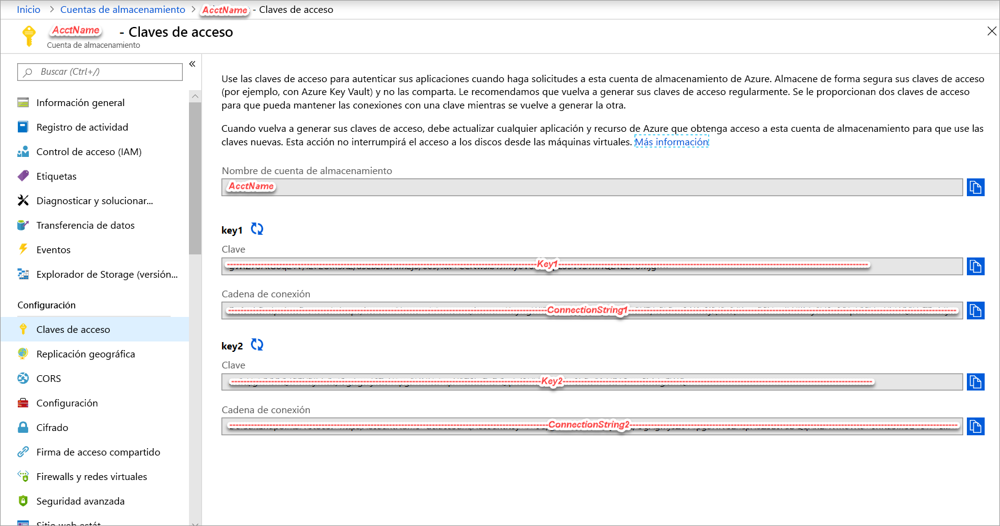
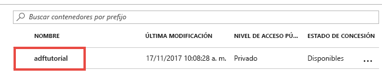

## <a name="prerequisites"></a>Requisitos previos

### <a name="azure-subscription"></a>Suscripción de Azure
Si no tiene una suscripción a Azure, cree una [cuenta gratuita](https://azure.microsoft.com/free/) antes de empezar.

### <a name="azure-roles"></a>Roles de Azure
Para crear instancias de Data Factory, la cuenta de usuario que use para iniciar sesión en Azure debe ser un miembro de los roles *colaborador* o *propietario*, o de *administrador* de la suscripción de Azure. En Azure Portal, seleccione su nombre de usuario en la esquina superior derecha y, después, seleccione **Permisos** para ver los permisos que tiene en la suscripción. Si tiene acceso a varias suscripciones, elija la correspondiente. 

Para crear y administrar recursos secundarios para Data Factory incluidos los conjuntos de datos, servicios vinculados, canalizaciones, desencadenadores y entornos de ejecución de integración, se aplican los siguientes requisitos:
- Para crear y administrar recursos secundarios en Azure Portal, debe pertenecer al rol **Colaborador de Data Factory** en el nivel de grupo de recursos u otro nivel superior.
- Para crear y administrar recursos secundarios con Powershell o el SDK, el rol de **Colaborador** en el nivel de recurso u otro nivel superior es suficiente.

Para obtener instrucciones de ejemplo sobre cómo agregar un usuario a un rol, consulte el artículo sobre la [adición de roles](../articles/billing/billing-add-change-azure-subscription-administrator.md).

Para más información, consulte los siguientes artículos:
- [Rol de Colaborador de Data Factory](../articles/role-based-access-control/built-in-roles.md#data-factory-contributor)
- [Roles y permisos para Azure Data Factory](../articles/data-factory/concepts-roles-permissions.md)

### <a name="azure-storage-account"></a>Cuenta de almacenamiento de Azure
En esta guía de inicio rápido, use una cuenta de almacenamiento de Azure (en concreto Blob Storage) de uso general como almacén de datos de *origen* y *destino*. Si no dispone de una cuenta de almacenamiento de Azure de uso general, consulte el artículo [Creación de una cuenta de almacenamiento](../articles/storage/common/storage-quickstart-create-account.md), donde se indica cómo crearla. 

#### <a name="get-the-storage-account-name-and-account-key"></a>Obtención de un nombre y una clave de cuenta de almacenamiento
En esta guía de inicio rápido necesitará el nombre y la clave de su cuenta de Azure Storage. El siguiente procedimiento especifica los pasos necesarios para obtener el nombre y la clave de una cuenta de almacenamiento: 

1. En un explorador web, vaya a [Azure Portal](https://portal.azure.com). Inicie sesión con su nombre de usuario y contraseña. 
2. Haga clic en **Todos los servicios**, en el menú de la izquierda, filtre por la palabra clave **Almacenamiento** y seleccione **Cuentas de almacenamiento**.

   
3. En la lista de cuentas de almacenamiento, filtre por su cuenta de almacenamiento (si fuera necesario) y, después, seleccione su cuenta de almacenamiento. 
4. En la página **Cuenta de almacenamiento**, seleccione **Claves de acceso** en el menú.

   
5. Copie los valores de los campos **Nombre de cuenta de almacenamiento** y **clave1** en el Portapapeles. Péguelos en el Bloc de notas o en cualquier otro editor y guárdelos. Los usará más adelante en esta guía.   

#### <a name="create-the-input-folder-and-files"></a>Creación de archivos y carpetas de entrada
En esta sección se crea un contenedor de blobs denominado **adftutorial** en la instancia de Azure Blob Storage. Va a crear una carpeta denominada **input** en el contenedor y cargar un archivo de ejemplo en la carpeta de entrada. 

1. En la página **Cuenta de almacenamiento**, cambie a **Información general** y, después, seleccione **Blobs**. 

   
2. En la página **Blob service**, seleccione **+ Contenedor** en la barra de herramientas. 

       
3. En el cuadro de diálogo **Nuevo contenedor**, escriba **adftutorial** para el nombre y seleccione **Aceptar**. 

   
4. En la lista de contenedores, seleccione **adftutorial**. 

   
5. En la página **Contenedor**, seleccione **Cargar** en la barra de herramientas.  

   
6. En la página **Cargar blob**, seleccione **Avanzado**.

   
7. Inicie el **Bloc de notas** y cree un archivo denominado **emp.txt** con el siguiente contenido. Guárdelo en la carpeta **c:\ADFv2QuickStartPSH**. Cree la carpeta **ADFv2QuickStartPSH** si todavía no existe.
    
   ```
   John, Doe
   Jane, Doe
   ```    
8. En Azure Portal, en la página **Cargar blob**, busque y seleccione el archivo **emp.txt** para el cuadro **Archivos**. 
9. Escriba **input** como valor del cuadro **Cargar en carpeta**. 

        
10. Confirme que la carpeta es **input** y el archivo es **emp.txt**, y seleccione **Cargar**.
    
    Debería ver el archivo **emp.txt** y el estado de la carga en la lista. 
12. Cierre la página **Cargar blob** haciendo clic en **X**, en la esquina. 

    
1. Mantenga abierta la página **Contenedor**. Úsela para comprobar la salida al final de esta guía de inicio rápido.