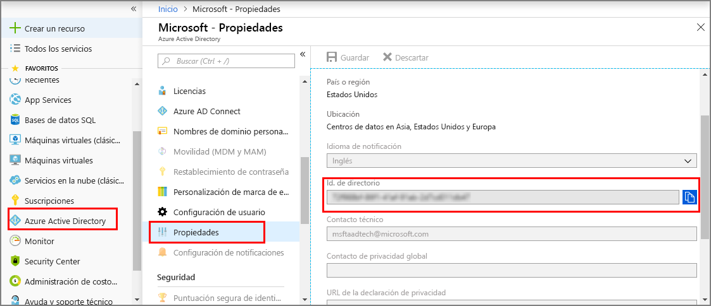
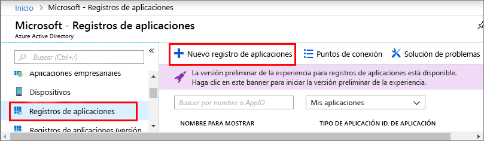

1. En [Azure Portal](https://portal.azure.com), abra **Azure Active Directory** desde el panel de navegación izquierdo y, luego, abra el panel **Propiedades**. Copie el **identificador de directorio** en un archivo temporal. Usará este valor para configurar la aplicación de ejemplo en la sección siguiente.

    

1. Abra el panel **Registros de aplicaciones** y, luego, haga clic en el botón **Nuevo registro de aplicaciones**.
    
    

1. Asigne un nombre descriptivo a este registro de aplicaciones en el campo **Nombre**. En **Tipo de aplicación**, elija **_Nativa_**, y en **URI de redirección**, seleccione **_https://microsoft.com_**. Haga clic en **Create**(Crear).

    

1. Abra la aplicación registrada y copie el valor del campo **Id. de la aplicación** en un archivo temporal; este valor identifica la aplicación de Azure Active Directory. Usará el identificador de la aplicación para configurar la aplicación de ejemplo en las secciones siguientes.

    

1. Abra el panel de registro de aplicaciones y haga clic en **Configuración** > **Permisos necesarios**:
    - Haga clic en **Agregar** en la parte superior izquierda para abrir el panel **Agregar acceso de API**.
    - Haga clic en **Seleccionar una API** y busque **Azure Digital Twins**. Si la búsqueda no encuentra la API, busque en su lugar **Azure Smart Spaces**.
    - Seleccione la opción **Azure Digital Twins (Azure Smart Spaces Service)** y haga clic en **Seleccionar**.
    - Haga clic en **Seleccionar permisos**. Maque la casilla de permisos delegados **Acceso de lectura y escritura** y haga clic en **Seleccionar**.
    - En la página **Agregar acceso de API**, haga clic en **Listo**.
    - En el panel **Permisos necesarios**, haga clic en el botón **Conceder permisos** y acepte la confirmación que aparece.

       
