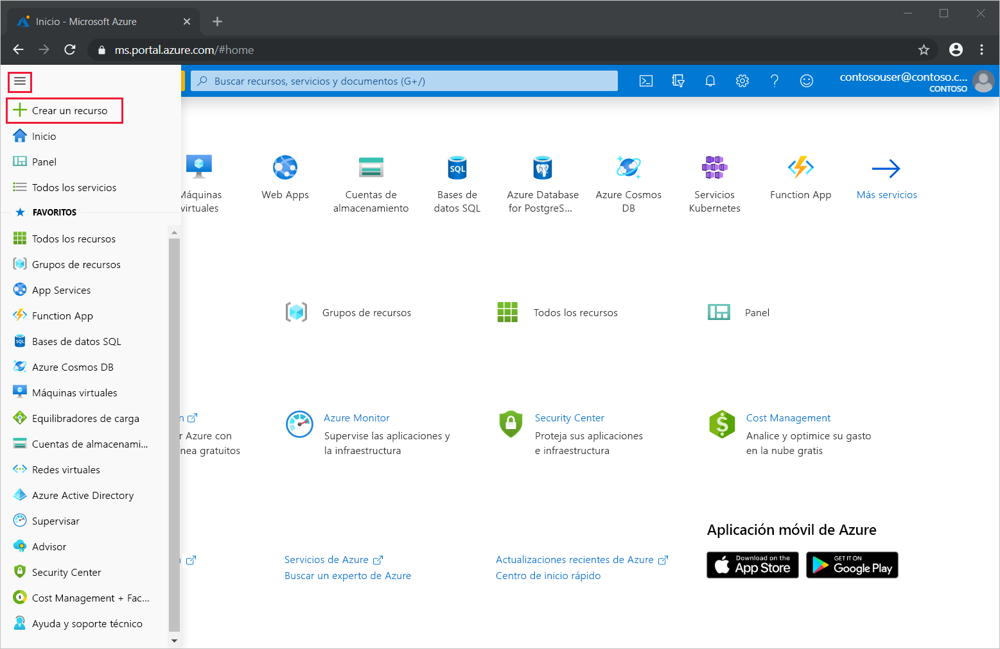
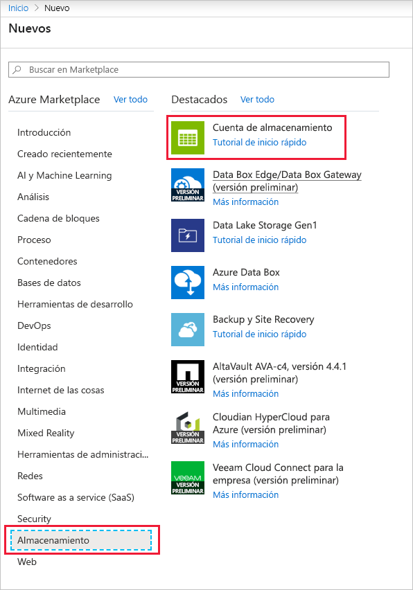
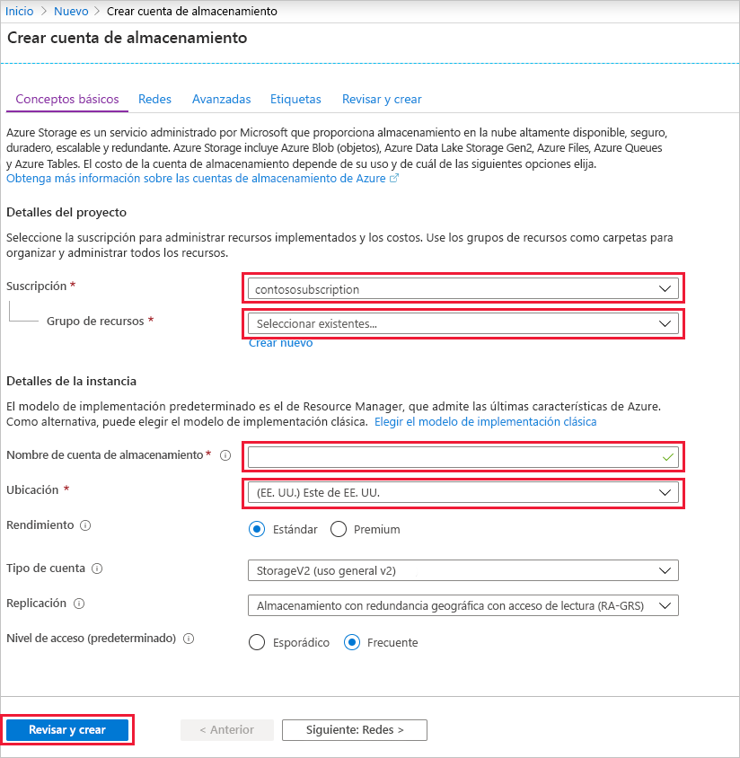
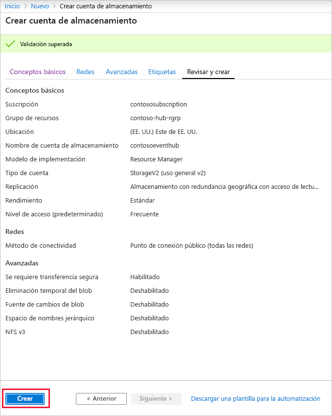
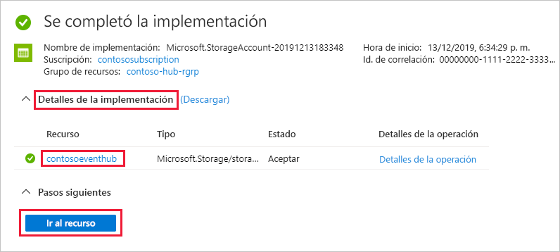
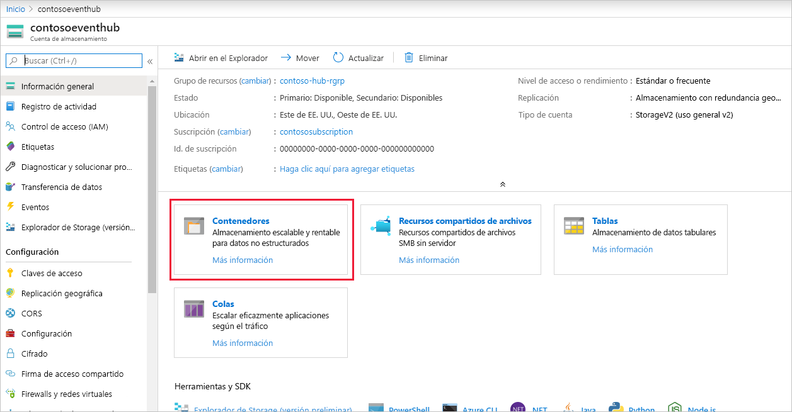
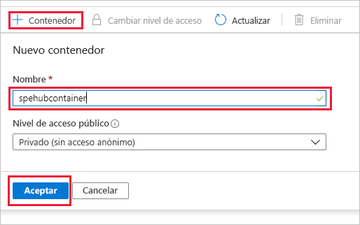

### Creación de una cuenta de almacenamiento para el host de procesador de eventos
El host de procesador de eventos es un agente inteligente que simplifica la recepción de eventos desde Event Hubs mediante la administración de puntos de control persistentes y recepciones paralelas. Para los puntos de comprobación, el host de procesador de eventos requiere una cuenta de almacenamiento. El ejemplo siguiente muestra cómo crear una cuenta de almacenamiento y cómo obtener sus claves para el acceso:

1. En el menú de Azure Portal, seleccione **Crear un recurso**.

    

2. Seleccione **Storage** > **Cuenta de Storage**.
   
    

3. En la página **Crear cuenta de almacenamiento**, realice los pasos siguientes: 

   1. Escriba el **nombre de la cuenta de almacenamiento**.
   2. Elija una **suscripción** de Azure que contenga el centro de eventos.
   3. Elija o cree el **grupo de recursos** que tenga el centro de eventos.
   4. Seleccione la **ubicación** en la que va a crear el recurso. 
   5. Seleccione **Revisar + crear**.
   
        

4. En la página **Revisar + crear**, revise los valores y seleccione **Crear**. 

    
5. Después de ver el mensaje **Correcto** en las notificaciones, seleccione **Ir al recurso** para abrir la página de la cuenta de almacenamiento. Como alternativa, puede expandir **Detalles de la implementación** y, después, seleccionar el nuevo recurso en la lista de recursos.  

     
6. Seleccione **Contenedores**.

    
7. Seleccione **+ Contenedor** en la parte superior, escriba un **nombre** para el contenedor y seleccione **Aceptar**. 

    
8. Elija **Claves de acceso** en el menú de la página **Cuenta de almacenamiento** y copie el valor de **key1**.

    Guarde los valores siguientes en el Bloc de notas o en cualquier otra ubicación temporal.
    - Nombre de la cuenta de almacenamiento
    - Clave de acceso para la cuenta de almacenamiento
    - Nombre del contenedor
