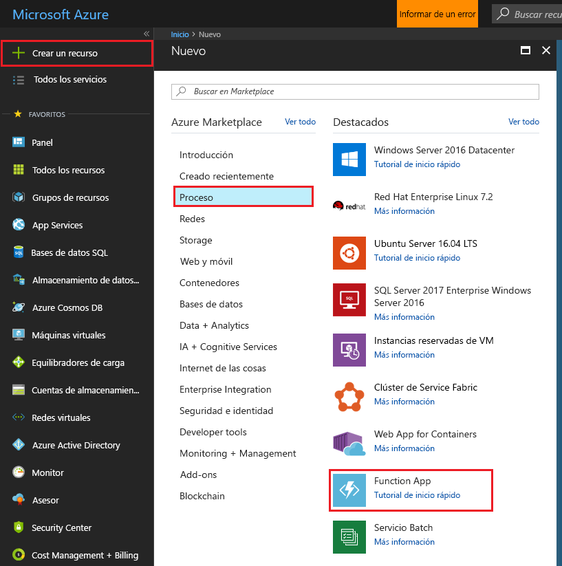
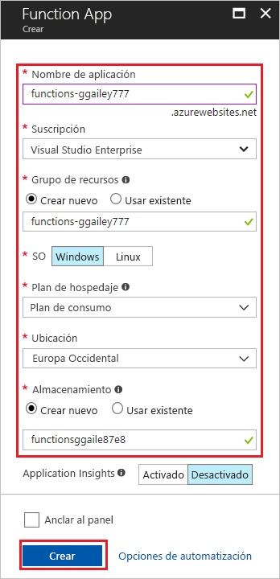
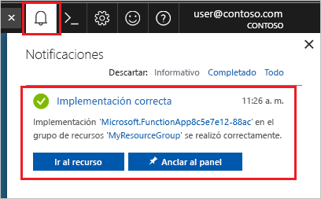

1. Seleccione el botón **Crear un recurso** de la esquina superior izquierda de Azure Portal y, después, **Proceso** > **Function App**.

    

2. Use la configuración de Function App especificada en la tabla debajo de la imagen.

    

    | Configuración      | Valor sugerido  | DESCRIPCIÓN                                        |
    | ------------ |  ------- | -------------------------------------------------- |
    | **Nombre de la aplicación** | Nombre único globalmente | Nombre que identifica la nueva Function App. Los caracteres válidos son `a-z`, `0-9` y `-`.  | 
    | **Suscripción** | Su suscripción | Suscripción en la que se creará esta nueva aplicación de función. | 
    | **[Grupo de recursos](../articles/azure-resource-manager/resource-group-overview.md)** |  myResourceGroup | Nombre para el nuevo grupo de recursos en el que se va a crear la Function App. |
    | **SISTEMA OPERATIVO** |  Windows | El hospedaje sin servidor en Linux está actualmente en versión preliminar. Para más información, consulte [este artículo](https://aka.ms/funclinux).|
    | **[Plan de hospedaje](../articles/azure-functions/functions-scale.md)** | Plan de consumo | Plan de hospedaje que define cómo se asignan los recursos a la Function App. En el **Plan de consumo** predeterminado, los recursos se agregan dinámicamente según lo requieran sus funciones. En este hospedaje [sin servidor](https://azure.microsoft.com/overview/serverless-computing/), solo paga por el tiempo durante el cual se ejecutan las funciones. Si ejecuta un plan de App Service, debe administrar el [escalado de la aplicación de función](../articles/azure-functions/functions-scale.md).  |
    | **Ubicación** | Europa occidental | Elija una [región](https://azure.microsoft.com/regions/) cerca de usted o cerca de otros servicios a los que tendrán acceso las funciones. |
    | **Pila en tiempo de ejecución** | Lenguaje preferido | Elija un tiempo de ejecución que admita su lenguaje de programación de funciones preferido. Elija **.NET** para funciones de C# y F#. |
    | **[Storage](../articles/storage/common/storage-quickstart-create-account.md)** |  Nombre único globalmente |  Cree una cuenta de almacenamiento que use la aplicación de función. Los nombres de las cuentas de almacenamiento deben tener entre 3 y 24 caracteres y solo pueden incluir números y letras en minúscula. También puede usar una cuenta existente que debe cumplir los [requisitos de la cuenta de almacenamiento](../articles/azure-functions/functions-scale.md#storage-account-requirements). |
    | **[Application Insights](../articles/azure-functions/functions-monitoring.md)** | Valor predeterminado | Crea un recurso de Application Insights con el mismo *nombre de aplicación* en la región más cercana que lo admita. Si expande esta configuración, puede cambiar el valor de **Nuevo nombre de recurso**  o elegir otro valor en **Ubicación** en la [ubicación geográfica de Azure](https://azure.microsoft.com/global-infrastructure/geographies/) donde desee almacenar los datos. |

3. Seleccione **Crear** para aprovisionar e implementar la aplicación de función.

4. Seleccione el icono de notificación de la esquina superior derecha del portal y observe el mensaje **Implementación correcta**.

    

5. Seleccione **Ir al recurso** para ver la nueva aplicación de función. También puede seleccionar **Anclar al panel**. Dicho anclaje facilita la vuelta a este recurso de aplicación de función desde el panel.
