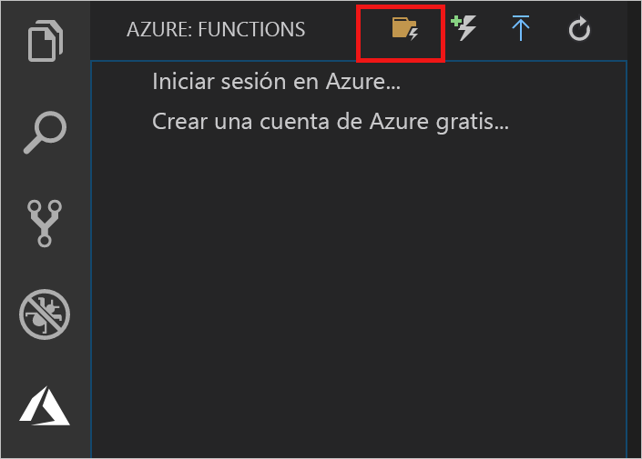

## Creación de un proyecto de Azure Functions

La plantilla del proyecto de Azure Functions de Visual Studio Code crea un proyecto que se puede publicar en una aplicación de función en Azure. Una aplicación de función permite agrupar funciones como una unidad lógica para la administración, la implementación y el uso compartido de recursos.

1. En Visual Studio Code, seleccione el logotipo de Azure para que se muestre el área **Azure: Functions** y, a continuación, seleccione el icono Crear nuevo proyecto.

    

1. Elija una ubicación para el área de trabajo del proyecto y elija **Seleccionar**.

    > [!NOTE]
    > Este artículo se ha diseñado para completarse fuera de un área de trabajo. Por tanto, no seleccione una carpeta de proyecto que forme parte de un área de trabajo.

1. Seleccione el lenguaje para el proyecto de la aplicación de función. En este artículo, se usa JavaScript.
    

1. Cuando se le solicite, elija **Agregar al área de trabajo**.

Visual Studio Code crea el proyecto de la aplicación de función en una nueva área de trabajo. Este proyecto contiene los archivos de configuración [host.json](../articles/azure-functions/functions-host-json.md) y [local.settings.json](../articles/azure-functions/functions-run-local.md#local-settings-file), además de los archivos de proyecto específicos del lenguaje. También obtendrá un nuevo repositorio de Git en la carpeta del proyecto.