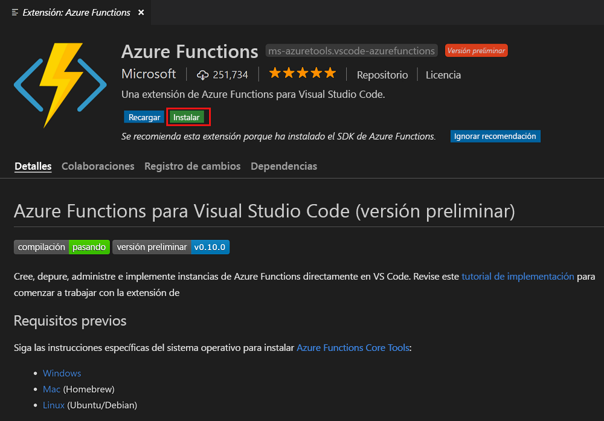
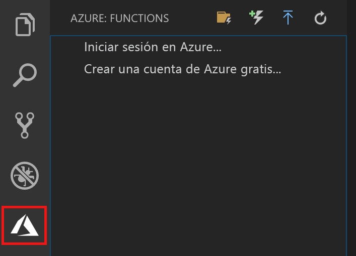

## Instalación de la extensión de Azure Functions

Puede usar la extensión de Azure Functions para crear y probar funciones e implementarlas en Azure.

1. En Visual Studio Code, abra **Extensiones** y busque **azure functions** o [seleccione este vínculo en Visual Studio Code](vscode:extension/ms-azuretools.vscode-azurefunctions).

1. Seleccione **Instalar** para instalar la extensión en Visual Studio Code.

    

1. Después de la instalación, seleccione el icono de Azure en la barra de actividad. Debería ver un área de Azure Functions en la barra lateral.

    