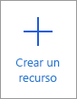
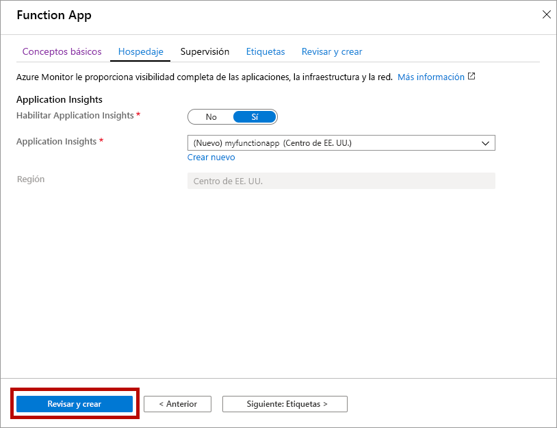

1. Abrir Azure Portal desde [https://portal.azure.com](https://portal.azure.com)

1. Seleccionar el botón **Crear un recurso**

    

1. Seleccione **Proceso** > **Aplicación de funciones**.

    

1. Use la configuración de Function App especificada en la tabla debajo de la imagen.

    

    | Configuración      | Valor sugerido  | DESCRIPCIÓN |
    | ------------ | ---------------- | ----------- |
    | **Suscripción** | Su suscripción | Suscripción en la que se creará esta nueva aplicación de función. |
    | **[Grupo de recursos](../articles/azure-resource-manager/resource-group-overview.md)** |  *myResourceGroup* | Nombre para el nuevo grupo de recursos en el que se va a crear la Function App. |
    | **Nombre de la aplicación de función** | Nombre único globalmente | Nombre que identifica la nueva Function App. Los caracteres válidos son `a-z` (no distingue mayúsculas de minúsculas), `0-9` y `-`.  |
    |**Publicar**| Código | Opción para publicar archivos de código o un contenedor de Docker. |
    | **Pila en tiempo de ejecución** | Lenguaje preferido | Elija un tiempo de ejecución que admita su lenguaje de programación de funciones preferido. Elija **.NET** para funciones de C# y F#. |
    |**Región**| Región preferida | Elija una [región](https://azure.microsoft.com/regions/) cerca de usted o cerca de otros servicios a los que tendrán acceso las funciones. |

    Seleccione el botón **Siguiente: Hospedaje >** .

1. Escriba la siguiente configuración para el hospedaje.

    

    | Configuración      | Valor sugerido  | DESCRIPCIÓN |
    | ------------ | ---------------- | ----------- |
    | **[Cuenta de almacenamiento](../articles/storage/common/storage-quickstart-create-account.md)** |  Nombre único globalmente |  Cree una cuenta de almacenamiento que use la aplicación de función. Los nombres de las cuentas de almacenamiento deben tener entre 3 y 24 caracteres y solo pueden incluir números y letras en minúscula. También puede usar una cuenta existente que debe cumplir los [requisitos de la cuenta de almacenamiento](../articles/azure-functions/functions-scale.md#storage-account-requirements). |
    |**Sistema operativo**| Sistema operativo preferido | Se preselecciona un sistema operativo en función de la selección de pila en tiempo de ejecución, pero puede cambiar esta configuración si es necesario. |
    | **[Plan](../articles/azure-functions/functions-scale.md)** | Premium | En Tipo de plan, seleccione **Premium (versión preliminar)** y seleccione los valores predeterminados para *Plan de Windows* y las selecciones de *SKU y tamaño*. |

    Seleccione el botón **Siguiente: Supervisión >** .

1. Escriba la siguiente configuración para la supervisión.

    

    | Configuración      | Valor sugerido  | DESCRIPCIÓN |
    | ------------ | ---------------- | ----------- |
    | **[Application Insights](../articles/azure-functions/functions-monitoring.md)** | Valor predeterminado | Crea un recurso de Application Insights con el mismo *nombre de aplicación* en la región más cercana que lo admita. Si expande esta configuración, puede cambiar el valor de **Nuevo nombre de recurso**  o elegir otro valor en **Ubicación** en la [ubicación geográfica de Azure](https://azure.microsoft.com/global-infrastructure/geographies/) donde desee almacenar los datos. |

    Seleccione **Revisar y crear** para revisar las selecciones de configuración de la aplicación.

1. Seleccione **Crear** para aprovisionar e implementar la aplicación de función.