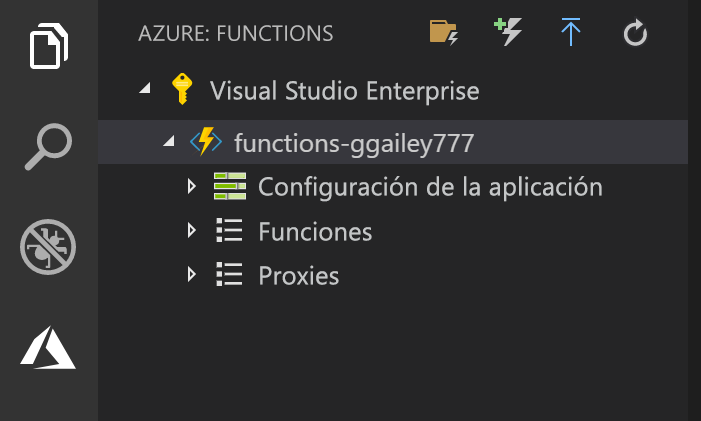

## Publicar el proyecto en Azure

Visual Studio Code le permite publicar el proyecto de Functions directamente en Azure. En el proceso, puede crear una aplicación de función y los recursos relacionados en su suscripción de Azure. La aplicación de función proporciona un contexto de ejecución para sus funciones. El proyecto se empaqueta e implementa en la nueva aplicación de función en su suscripción de Azure. 

En este artículo se da por supuesto que va a crear una nueva aplicación de función. La publicación en una aplicación de función existente sobrescribe el contenido de esa aplicación en Azure.

1. En el área **Azure: Functions**, seleccione el icono de implementación en la aplicación de función.

    

1. Elija la carpeta del proyecto que, en este caso, es el área de trabajo actual.

1. Si tiene más de una suscripción, elija la que desee para hospedar su aplicación de función y, a continuación, elija **+ Create New Function App** (+ Crear nueva aplicación de función).

1. Escriba un nombre único global que identifique la aplicación de función y presione ENTRAR. Los siguientes son caracteres válidos para un nombre de aplicación de función: `a-z`, `0-9` y `-`.

1. Elija **+ Crear un nuevo grupo de recursos**, escriba un nombre para el grupo de recursos, como `myResourceGroup` y presione ENTRAR. También puede usar un grupo de recursos existente.

1. Elija **+ Crear nueva cuenta de almacenamiento**, escriba un nombre único global para la nueva cuenta de almacenamiento que va a usar la aplicación de función y presione ENTRAR. Los nombres de las cuentas de almacenamiento deben tener entre 3 y 24 caracteres y solo pueden incluir números y letras en minúscula. También puede usar una cuenta existente.

1. Elija una ubicación en una [región](https://azure.microsoft.com/regions/) cercana a usted o a otros servicios a los que accedan las funciones.

    La creación de la aplicación de función se inicia después de elegir la ubicación. Una vez que se haya creado la aplicación de función se mostrará una notificación y se aplicará el paquete de implementación.

1. Seleccione **View Output** (Ver salida) en las notificaciones para ver la creación y los resultados de la implementación, incluidos los recursos de Azure que ha creado.

    

1. Anote la dirección URL de la nueva aplicación de función en Azure. Utilícela para probar la función después de que el proyecto se publique en Azure.

    

1. En el área **Azure: Functions** puede ver la nueva aplicación de función que aparece en su suscripción. Al expandir este nodo, puede ver las funciones de la aplicación de función, así como la configuración de la aplicación y los servidores proxy de la función.

    

    En el nodo de la aplicación de función, escriba Ctrl y haga clic (clic con el botón derecho) para realizar diversas tareas de administración y configuración de la aplicación de función en Azure. También puede decidir ver la aplicación de función en Azure Portal.
