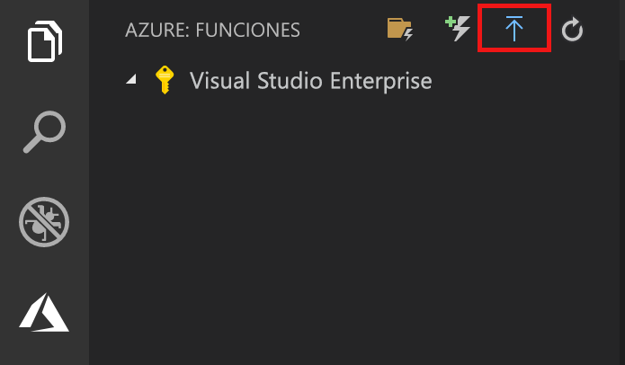
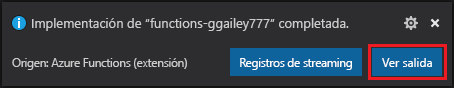
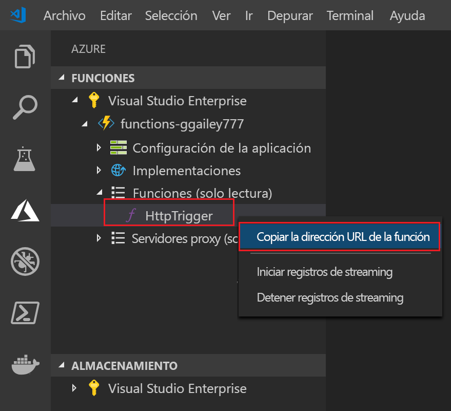

## Publicar el proyecto en Azure

En esta sección, va a crear una aplicación de funciones y los recursos relacionados en su suscripción de Azure y, después, va a implementar el código. 

1. Seleccione el icono de Azure en la barra de actividades y después en el área **Azure: Functions**, seleccione el botón de **implementación en la aplicación de funciones**.

    

1. Escriba la siguiente información cuando se le indique:

    ::: zone pivot="programming-language-csharp,programming-language-powershell"

    | Prompt | Value | Descripción |
    | ------ | ----- | ----- |
    | Seleccionar suscripción | Su suscripción | Se muestra cuando tiene varias suscripciones |
    | Seleccionar aplicación de funciones en Azure | + Crear una aplicación de funciones | La publicación en una aplicación de función existente sobrescribe el contenido de esa aplicación en Azure. |
    | Escriba un nombre único global para la aplicación de funciones. | Nombre único | Los siguientes son caracteres válidos para un nombre de aplicación de función: `a-z`, `0-9` y `-`. |
    | Seleccione una ubicación para los nuevos recursos | Region | Seleccione una [región](https://azure.microsoft.com/regions/) cerca de usted. | 

    ::: zone-end

    ::: zone pivot="programming-language-javascript,programming-language-typescript,programming-language-python"

    | Prompt | Value | Descripción |
    | ------ | ----- | ----- |
    | Seleccionar suscripción | Su suscripción | Se muestra cuando tiene varias suscripciones |
    | Seleccionar aplicación de funciones en Azure | + Crear una aplicación de funciones | La publicación en una aplicación de función existente sobrescribe el contenido de esa aplicación en Azure. |
    | Escriba un nombre único global para la aplicación de funciones. | Nombre único | Los siguientes son caracteres válidos para un nombre de aplicación de función: `a-z`, `0-9` y `-`. |
    | Seleccionar un entorno de ejecución. | Su versión. | Elija la versión de lenguaje en la que se ha estado ejecutando localmente. |
    | Seleccione una ubicación para los nuevos recursos | Region | Seleccione una [región](https://azure.microsoft.com/regions/) cerca de usted. | 

    ::: zone-end

    
1.  Cuando se complete, se crearán los siguientes recursos de Azure en la suscripción:

    + **[Grupo de recursos](../articles/azure-resource-manager/management/overview.md)** : contiene todos los recursos de Azure creados. El nombre se basa en el nombre de la aplicación de función.
    + **[Cuenta de almacenamiento](../articles//storage/common/storage-introduction.md#types-of-storage-accounts)** : se crea una cuenta de almacenamiento estándar con un nombre único en función del nombre de la aplicación de función.
    + **[Plan de hospedaje](../articles/azure-functions/functions-scale.md)** : se crea un plan de consumo en la región Oeste de EE. UU. para hospedar la aplicación de función sin servidor.
    + **Aplicación de función**: el proyecto se implementa y ejecuta en esta aplicación de función nueva.
    + **[Application Insights]()** : Se crea una instancia, que está conectada a la aplicación de funciones, en función del nombre de la función.

    Una vez que se haya creado la aplicación de función se mostrará una notificación y se aplicará el paquete de implementación. 
    
1. Seleccione **View Output** (Ver salida) en esta notificación para ver la creación y los resultados de la implementación, incluidos los recursos de Azure que ha creado.

    

1. Vuelva al área **Azure: Functions** en la barra lateral y expanda la aplicación de funciones nueva en la suscripción. Expanda **Funciones**, haga clic con el botón derecho (Windows) o presione Ctrl + clic (MacOS) en **HttpExample** y, a continuación, elija **Copy function URL** (Copiar la dirección URL de la función).

    
