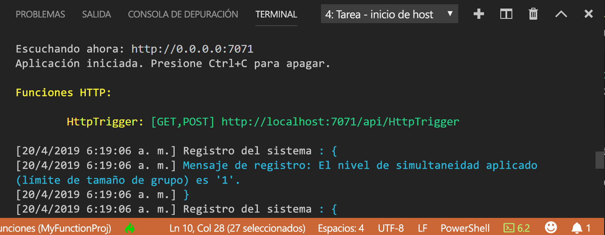

## <a name="run-the-function-locally"></a>Ejecución local de la función

Azure Functions Core Tools se integra con Visual Studio Code para permitirle ejecutar y depurar un proyecto de Azure Functions localmente.  

1. Para depurar la función, inserte una llamada al cmdlet [`Wait-Debugger`](/powershell/module/microsoft.powershell.utility/wait-debugger?view=powershell-6) en el código de la función antes de adjuntar el depurador y luego presione F5 para iniciar el proyecto de la aplicación de función y adjuntar el depurador. La salida de Core Tools aparece en el panel **Terminal**.

1. En el panel **Terminal**, copie el punto de conexión de la dirección URL de la función desencadenada por HTTP.

    

1. Anexe la cadena de consulta `?name=<yourname>` a esta dirección URL y use después `Invoke-RestMethod` en un segundo símbolo del sistema de PowerShell para ejecutar la solicitud, del modo siguiente:

    ```powershell
    PS > Invoke-RestMethod -Method Get -Uri http://localhost:7071/api/HttpTrigger?name=PowerShell
    Hello PowerShell
    ```

    También puede ejecutar la solicitud GET desde un explorador.

    Cuando se llama al punto de conexión HttpTrigger sin pasar un parámetro `name` como un parámetro de consulta o en el cuerpo, la función devuelve un error [HttpStatusCode]::BadRequest. Al revisar el código de run.ps1, verá que este error se produce por diseño.

1. Para detener la depuración, presione Mayús + F5.

Después de comprobar que la función se ejecuta correctamente en el equipo local es el momento de publicar el proyecto en Azure.

> [!NOTE]
> No olvide quitar todas las llamadas a `Wait-Debugger` antes de publicar sus funciones en Azure. 