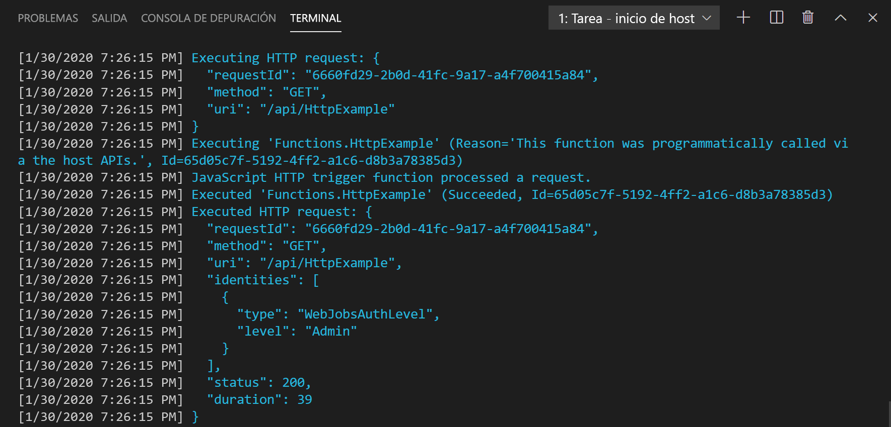

## <a name="run-the-function-locally"></a>Ejecución local de la función

Azure Functions Core Tools se integra con Visual Studio Code para permitirle ejecutar y depurar un proyecto de Azure Functions localmente. Para más información sobre cómo depurar en Visual Studio Code, consulte [Depuración local de Azure Functions de PowerShell](../articles/azure-functions/functions-debug-powershell-local.md). 

1. Presione F5 para iniciar el proyecto de la aplicación de función. La salida de Core Tools aparece en el panel **Terminal**.

1. En el panel **Terminal**, copie el punto de conexión de la dirección URL de la función desencadenada por HTTP.

    

1. Anexe la cadena de consulta `?name=<yourname>` a esta dirección URL y use después `Invoke-RestMethod` en un segundo símbolo del sistema de PowerShell para ejecutar la solicitud, del modo siguiente:

    ```powershell
    PS > Invoke-RestMethod -Method Get -Uri http://localhost:7071/api/HttpTrigger?name=PowerShell
    Hello PowerShell
    ```

    También puede ejecutar la solicitud GET de un explorador desde la siguiente dirección URL.

    <http://localhost:7071/api/HttpExample?name=PowerShell>

    Cuando se llama al punto de conexión HttpTrigger sin pasar un parámetro `name` como un parámetro de consulta o en el cuerpo, la función devuelve un error `BadRequest`. Al revisar el código de run.ps1, verá que este error se produce por diseño.

1. La información sobre la solicitud se muestra en el panel **Terminal**.

    

1. Cuando haya terminado, presione **Ctrl + C** para detener Core Tools.

Después de comprobar que la función se ejecuta correctamente en el equipo local es el momento de publicar el proyecto en Azure.