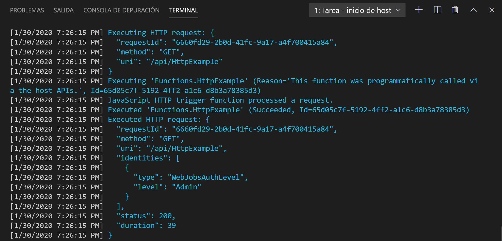

## Ejecución local de la función

Visual Studio Code se integra con [Azure Functions Core Tools](../articles/azure-functions/functions-run-local.md) para que pueda ejecutar este proyecto en el equipo de desarrollo local antes de publicarlo en Azure.

1. Para llamar a la función, presione F5 para iniciar el proyecto de aplicación de funciones. La salida de Core Tools aparece en el panel **Terminal**.

1. Si aún no ha instalado Azure Functions Core Tools, seleccione **Instalar** en el símbolo del sistema. Cuando se instala Core Tools, la aplicación se inicia en el panel **Terminal**. Puede ver el punto de conexión de la dirección URL de la función desencadenada por HTTP que se ejecuta localmente. 

    

1. Con Core Tools en ejecución, vaya a la siguiente dirección URL para ejecutar una solicitud GET, que incluye la cadena de consulta `?name=Functions`.

    <http://localhost:7071/api/HttpExample?name=Functions>

1. Se devuelve una respuesta, que tiene un aspecto similar al siguiente en un explorador:

    

1. La información sobre la solicitud se muestra en el panel **Terminal**.

    

1. Presione Ctrl + C para detener Core Tools y desconectar el depurador.
