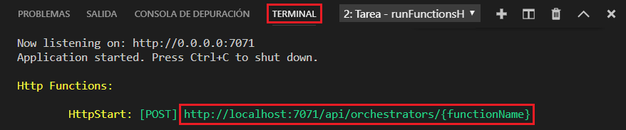
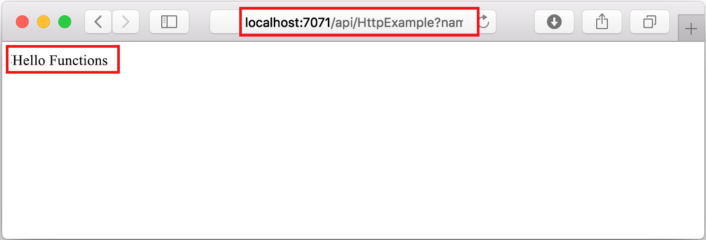

## Ejecución local de la función

Visual Studio Code se integra con [Azure Functions Core Tools](../articles/azure-functions/functions-run-local.md) para que pueda ejecutar este proyecto en el equipo de desarrollo local antes de publicarlo en Azure.

1. Para llamar a la función, presione F5 para iniciar el proyecto de aplicación de funciones. La salida de Core Tools aparece en el panel **Terminal**.

1. Si aún no ha instalado Azure Functions Core Tools, seleccione **Instalar** en el símbolo del sistema. Cuando se instala Core Tools, la aplicación se inicia en el panel **Terminal**.

1. En el panel **Terminal**, copie el punto de conexión de la dirección URL de la función desencadenada por HTTP. 

    

1. Pegue la dirección URL de la solicitud HTTP en la barra de direcciones del explorador. Anexe la cadena de consulta `?name=<yourname>` a esta dirección URL y ejecute la solicitud GET. 

1. Se devuelve una respuesta, que tiene un aspecto similar al siguiente en un explorador:

    

1. Presione Mayús + F5 para detener Core Tools y desconectar el depurador.
