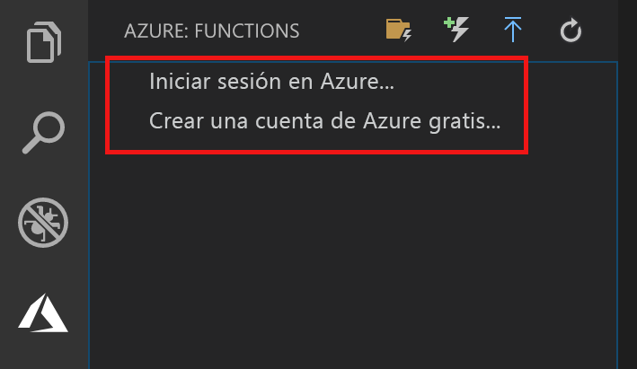

## Inicio de sesión en Azure

Para poder publicar la aplicación, debe iniciar sesión en Azure.

1. En el área **Azure: Functions**, elija **Iniciar sesión en Azure…** . En caso de no tener ninguna cuenta, seleccione **Crear una cuenta de Azure gratis**.

    

1. Cuando se le solicite, seleccione **Copiar y abrir**, o copie el código que aparece y abra <https://aka.ms/devicelogin> en el explorador.

1. Pegue el código copiado en la página **Inicio de sesión del dispositivo**, compruebe el inicio de sesión de Visual Studio Code y luego seleccione **Continuar**.  

1. Termine el inicio de sesión con las credenciales de su cuenta de Azure. Cuando haya iniciado sesión correctamente, puede cerrar el explorador.
