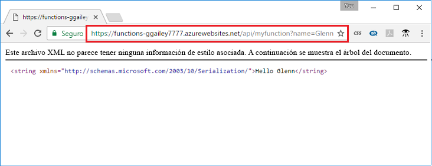

## Comprobación de la función en Azure

Puede usar un explorador web para comprobar la función implementada.  Copie la dirección URL, incluida la clave de función, en la barra de direcciones del explorador web. Anexe la cadena de consulta `&name=<yourname>` a la dirección URL antes de ejecutar la solicitud.

  

También puede usar cURL para comprobar la función implementada. Con la dirección URL que copió del paso anterior, anexe la cadena de consulta `&name=<yourname>` a la dirección URL.

 

