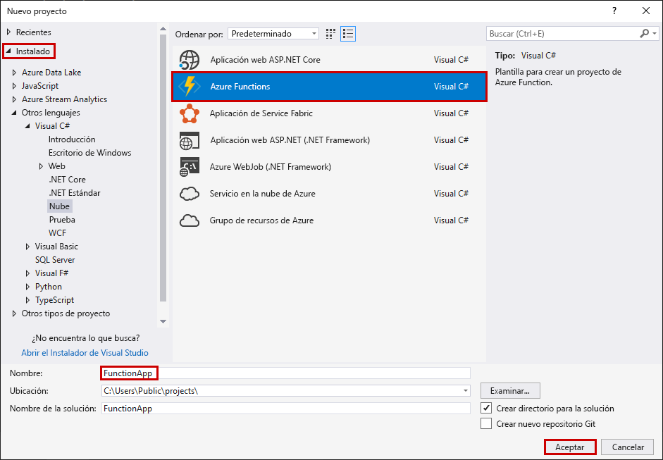
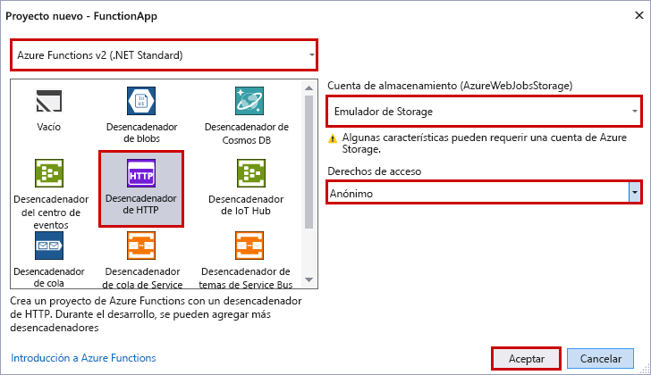

La plantilla del proyecto de Azure Functions de Visual Studio crea un proyecto que se puede publicar en una aplicación de función en Azure. Puede usar una aplicación de función para agrupar funciones como una unidad lógica para la administración, la implementación y el uso compartido de recursos.

1. En Visual Studio, en el menú **Archivo**, seleccione **Nuevo** > **Proyecto**.

2. En el cuadro de diálogo **Nuevo proyecto** seleccione **Instalado** > **Visual C#** > **Nube** > **Azure Functions**. Escriba el nombre del proyecto y seleccione **Aceptar**. El nombre de la aplicación de función debe ser válido como espacio de nombres de C#, por lo que no debe usar guiones bajos, guiones u otros caracteres no alfanuméricos.

    

3. Use la configuración especificada en la tabla que aparece después de la imagen.

     

    | Configuración      | Valor sugerido  | DESCRIPCIÓN                      |
    | ------------ |  ------- |----------------------------------------- |
    | **Versión** | Azure Functions 2.x  (.NET Core) | Este valor crea un proyecto de función que usa la versión 2.x del entorno de ejecución de Azure Functions, que es compatible con .NET Core. Azure Functions 1.x admite .NET Framework. Para más información, consulte [Cómo seleccionar un destino para versiones en tiempo de ejecución de Azure Functions](../articles/azure-functions/functions-versions.md).   |
    | **Plantilla** | Desencadenador HTTP | Con este valor se crea una función desencadenada por una solicitud HTTP. |
    | **Cuenta de almacenamiento**  | Emulador de Storage | Un desencadenador HTTP no usa la conexión de la cuenta de Azure Storage. Todos los demás tipos de desencadenador requieren una cadena de conexión de cuenta de Storage válida. |
    | **Derechos de acceso** | Anónimas | Cualquier cliente puede desencadenar una función creada sin tener que proporcionar una clave. Esta configuración de autorización facilita probar la función nueva. Para más información sobre las claves y la autorización, consulte [Claves de autorización](../articles/azure-functions/functions-bindings-http-webhook.md#authorization-keys) en los [enlaces HTTP y de webhook](../articles/azure-functions/functions-bindings-http-webhook.md). |
    
    > [!NOTE]
    > Asegúrese de establecer los **derechos de acceso** en `Anonymous`. Al elegir el nivel predeterminado de `Function`, tiene que presentar la [tecla de función](../articles/azure-functions/functions-bindings-http-webhook.md#authorization-keys) en las solicitudes para acceder al punto de conexión de la función.
    
4. Seleccione **Aceptar** para crear el proyecto de función y la función que se desencadena mediante HTTP.

