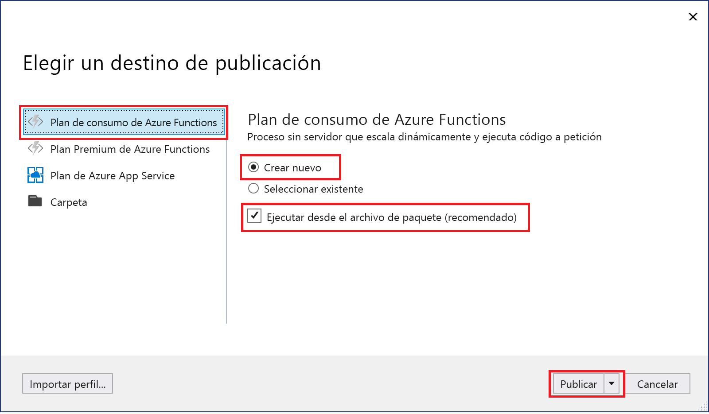
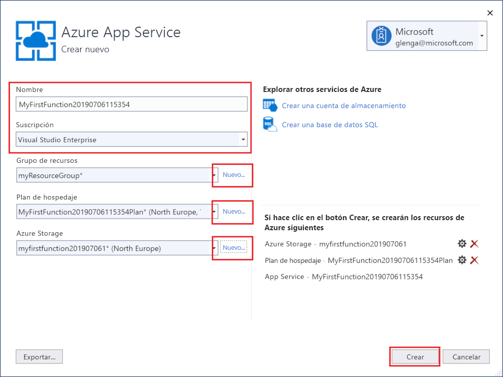
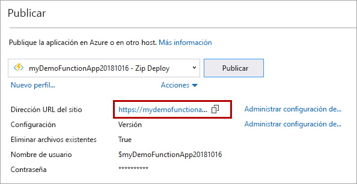

1. En el **Explorador de soluciones**, haga clic con el botón derecho en el proyecto y seleccione **Publicar**.

2. En el cuadro de diálogo **Elegir un destino de publicación**, use las opciones de publicación que se especifican en la tabla que aparece debajo de la imagen: 

    

    | Opción      | DESCRIPCIÓN                                |
    | ------------ |  -------------------------------------------------- |
    | **Azure Functions Consumption plan** (Plan de consumo de Azure Functions) |   Si publica el proyecto en una aplicación de funciones que se ejecuta en un [plan de consumo](../articles/azure-functions/functions-scale.md#consumption-plan), solo paga por las ejecuciones de la aplicación. Otros planes de hospedaje suponen costos más elevados. Para más información, consulte [Escalado y hospedaje de Azure Functions](../articles/azure-functions/functions-scale.md). | 
    | **Cree uno nuevo** | En Azure se crea una nueva aplicación de funciones, con recursos relacionados. Al elegir **Seleccionar existente**, todos los archivos de la aplicación de función existente en Azure se sobrescriben con los archivos del proyecto local. Use esta opción solo al volver a publicar actualizaciones en una aplicación de función existente. |
    | **Ejecución desde el archivo de paquete** | La aplicación de funciones se implementa con la [implementación de un archivo zip](../articles/azure-functions/functions-deployment-technologies.md#zip-deploy) y con el modo de [ejecución desde el paquete](../articles/azure-functions/run-functions-from-deployment-package.md) habilitado. Esta es la forma recomendada de ejecutar las funciones, ya que supone una mejora del rendimiento. |

3. Seleccione **Publicar**. Si aún no ha iniciado sesión en la cuenta de Azure desde Visual Studio, seleccione **Iniciar sesión**. También puede crear una cuenta de Azure gratis.

4. En el cuadro de diálogo **App Service: Crear nuevo**, use la configuración de **hospedaje** que se especifica en la tabla incluida debajo de la imagen:

    

    | Configuración      | Valor sugerido  | Descripción                                |
    | ------------ |  ------- | -------------------------------------------------- |
    | **Nombre** | Nombre único globalmente | Nombre que identifica de forma única la nueva aplicación de función. Los caracteres válidos son `a-z`, `0-9` y `-`. |
    | **Suscripción** | Elija una suscripción | La suscripción de Azure que se va a usar. |
    | **[Grupo de recursos](../articles/azure-resource-manager/resource-group-overview.md)** | myResourceGroup |  Nombre del grupo de recursos en el que se va a crear la aplicación de función. Elija **Nuevo** para crear un grupo de recursos nuevo.|
    | **[Plan de hospedaje](../articles/azure-functions/functions-scale.md)** | Plan de consumo | Asegúrese de que elige **Consumo** en **Tamaño** después de seleccionar **Nuevo**, para crear un plan sin servidor. Además, elija una **ubicación** en una [región](https://azure.microsoft.com/regions/) cercana a usted o a otros servicios a los que acceden las funciones. Si ejecuta un plan distinto a **Consumo**, debe administrar el [escalado de la aplicación de función](../articles/azure-functions/functions-scale.md).  |
    | **[Azure Storage](../articles/storage/common/storage-quickstart-create-account.md)** | Cuenta de almacenamiento de uso general | El entorno de ejecución de Functions necesita una cuenta de Azure Storage. Seleccione **Nuevo** para crear una cuenta de almacenamiento de uso general. También puede usar una cuenta existente que cumpla los [requisitos de la cuenta de almacenamiento](../articles/azure-functions/functions-scale.md#storage-account-requirements).  |

5. Seleccione **Crear** para crear una aplicación de funciones y los recursos relacionados en Azure con esta configuración e implemente el código del proyecto de función. 

6. Una vez finalizada la implementación, anote el valor de la **dirección URL del sitio**, que es la dirección de la aplicación de función en Azure.

    
