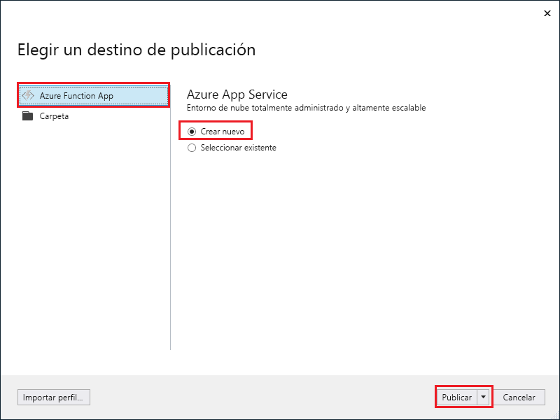
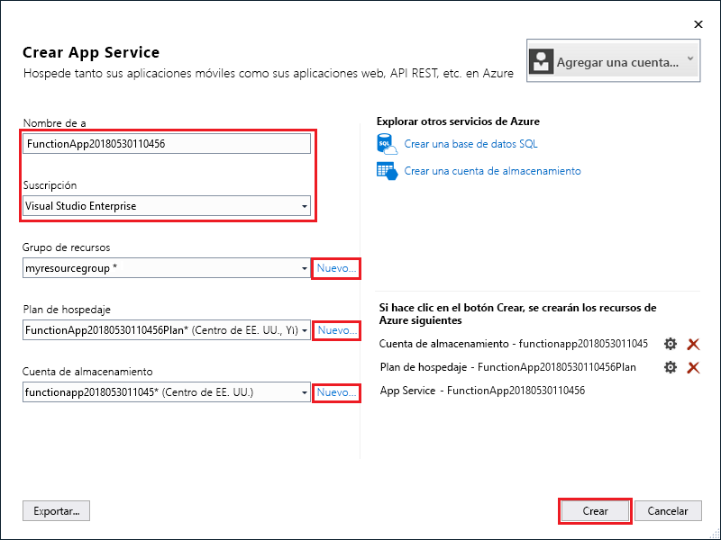
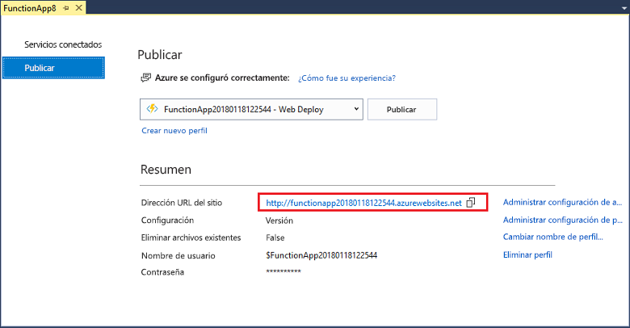

1. En el **Explorador de soluciones**, haga clic con el botón derecho en el proyecto y seleccione **Publicar**.

2. Seleccione **Azure Function App**, elija **Crear nuevo**y, después, seleccione **Publicar**.

    

3. Si todavía no conectó Visual Studio a su cuenta de Azure, seleccione **Agregar una cuenta...**.

4. En el cuadro de diálogo **Crear servicio de aplicaciones**, utilice la configuración de **Hospedaje** que se especifica en la tabla que hay debajo de la imagen:

    

    | Configuración      | Valor sugerido  | DESCRIPCIÓN                                |
    | ------------ |  ------- | -------------------------------------------------- |
    | **Nombre de aplicación** | Nombre único globalmente | Nombre que identifica de forma única la nueva aplicación de función. |
    | **Suscripción** | Elija una suscripción | La suscripción de Azure que se va a usar. |
    | **[Grupo de recursos](../articles/azure-resource-manager/resource-group-overview.md)** | myResourceGroup |  Nombre del grupo de recursos en el que se va a crear la aplicación de función. Elija **Nuevo** para crear un grupo de recursos nuevo.|
    | **[Plan de App Service](../articles/azure-functions/functions-scale.md)** | Plan de consumo | Asegúrese de que elige **Consumo** en **Tamaño** después de hacer clic en **Nuevo** para crear un plan sin servidor. Además, elija una **ubicación** en una [región](https://azure.microsoft.com/regions/) cercana a usted o a otros servicios a los que acceden las funciones. Si ejecuta un plan distinto a **Consumo**, debe administrar el [escalado de la aplicación de función](../articles/azure-functions/functions-scale.md).  |
    | **[Cuenta de almacenamiento](../articles/storage/common/storage-quickstart-create-account.md)** | Cuenta de almacenamiento de uso general | El entorno de ejecución de Functions necesita una cuenta de Azure Storage. Haga clic en **Nuevo** para crear una cuenta de almacenamiento de uso general. También puede usar una cuenta existente que cumpla los [requisitos de la cuenta de almacenamiento](../articles/azure-functions/functions-scale.md#storage-account-requirements).  |

5. Haga clic en **Crear** para crear una aplicación de función y los recursos relacionados en Azure con esta configuración e implemente el código del proyecto de función. 

6. Una vez finalizada la implementación, anote el valor de la **dirección URL del sitio**, que es la dirección de la aplicación de función en Azure.

    
