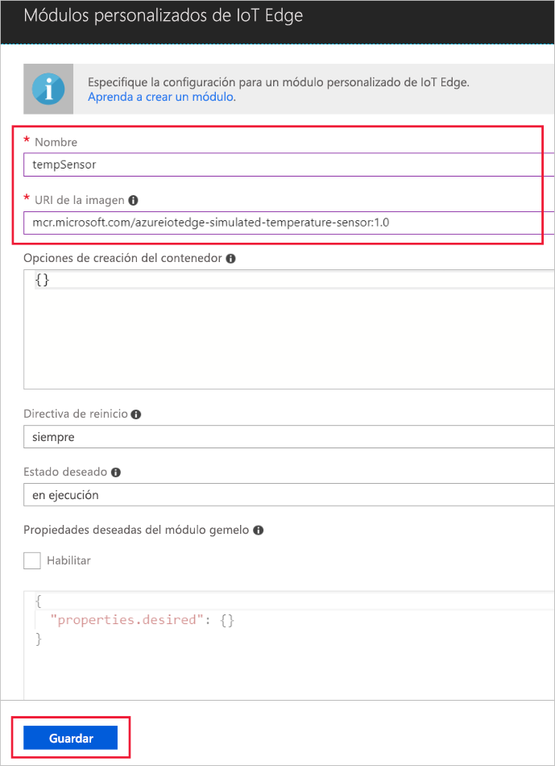

Una de las funcionalidades clave de Azure IoT Edge es que puede implementar módulos en dispositivos de IoT Edge desde la nube. Un módulo de IoT Edge es un paquete ejecutable que se implementa como un contenedor. En esta sección se implementa un módulo que genera telemetría para un dispositivo simulado. 

1. En Azure Portal, navegue hasta el centro de IoT.
1. Vaya a **IoT Edge** y seleccione el dispositivo IoT Edge.
1. Seleccione **Set modules** (Establecer módulos).
1. En la sección **Módulos de implementación** de la página, haga clic en **Agregar** y, a continuación, seleccione **Módulo IoT Edge**.
1. En el campo **Nombre**, escriba `tempSensor`. 
1. En el campo **URI de la imagen**, escriba `mcr.microsoft.com/azureiotedge-simulated-temperature-sensor:1.0`. 
1. Deje los restantes valores tal cual y seleccione **Guardar**.

   

1. Vuelva al paso **Add modules** (Agregar módulos) y seleccione **Siguiente**.
1. En el paso **Specify routes** (Especificar rutas), debe tener una ruta predeterminada que envíe todos los mensajes de todos los módulos a IoT Hub. Si no es así, agregue el código siguiente y, a continuación, seleccione **Next** (Siguiente).

   ```json
   {
       "routes": {
           "route": "FROM /messages/* INTO $upstream"
       }
   }
   ```

1. En el paso **Review Deployment** (Revisar implementación), seleccione **Submit** (Enviar).
1. Vuelva a la página de detalles del dispositivo y seleccione **Actualizar**. Además del módulo edgeAgent que se creó cuando inició por primera vez el servicio, debería aparecer otro módulo de runtime llamado **edgeHub** y el módulo **tempSensor** en la lista. 

   
