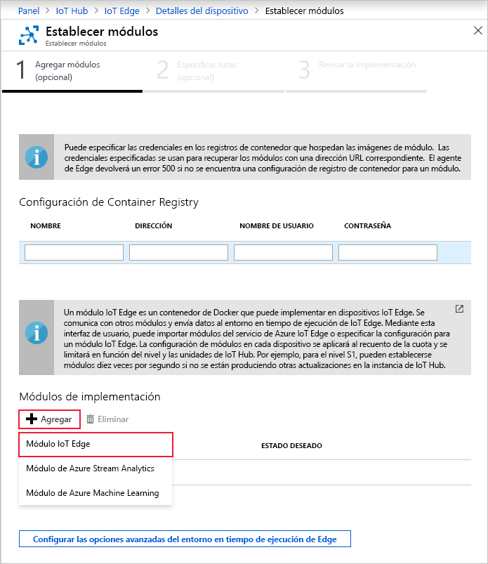

Una de las funcionalidades clave de Azure IoT Edge es que puede implementar módulos en dispositivos de IoT Edge desde la nube. Un módulo de IoT Edge es un paquete ejecutable que se implementa como un contenedor. En esta sección se implementa un módulo que genera telemetría para un dispositivo simulado.

1. En Azure Portal, vaya hasta el centro de IoT.

2. Vaya a **IoT Edge** en **Administración de dispositivos automática** y seleccione el dispositivo de IoT Edge.

3. Seleccione **Set modules** (Establecer módulos). Se abre un asistente de tres pasos en el portal que le explica cómo agregar módulos, especificar rutas y revisar la implementación. 

4. En el paso **Add Modules** (Agregar módulos) del asistente, busque la sección **Deployment Modules** (Módulos de implementación). Haga clic en **Add** (Agregar) y, después, seleccione **IoT Edge Module** (Módulo de IoT Edge).

   

5. En el campo **Nombre**, escriba `tempSensor`.

6. En el campo **URI de la imagen**, escriba `mcr.microsoft.com/azureiotedge-simulated-temperature-sensor:1.0`.

7. Deje los restantes valores tal cual y seleccione **Guardar**.

   

8. De nuevo en el primer paso del asistente, seleccione **Siguiente**.

9. En el paso **Specify routes** (Especificar rutas) del asistente, debe tener una ruta predeterminada que envíe todos los mensajes de todos los módulos a IoT Hub. Si no es así, agregue el código siguiente y seleccione **Next** (Siguiente).

   ```json
   {
       "routes": {
           "route": "FROM /messages/* INTO $upstream"
       }
   }
   ```

10. En el paso **Review Deployment** (Revisar implementación) del asistente, seleccione **Submit** (Enviar).

11. Vuelva a la página de detalles del dispositivo y seleccione **Actualizar**. Además del módulo edgeAgent que se creó cuando inició por primera vez el servicio, debería aparecer otro módulo de runtime llamado **edgeHub** y el módulo **tempSensor** en la lista.

   Los nuevos módulos pueden tardar unos minutos en mostrarse. El dispositivo IoT Edge debe recuperar su nueva información de implementación de IoT Hub, iniciar los contenedores y, a continuación, notificar su nuevo estado a IoT Hub. 

   
