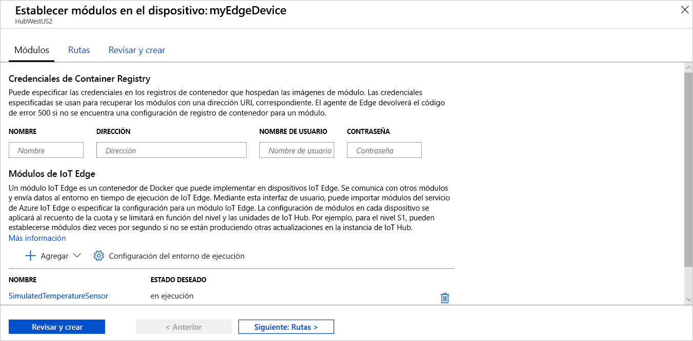

Una de las funcionalidades clave de Azure IoT Edge es que puede implementar código en dispositivos de IoT Edge desde la nube. Los **módulos de IoT Edge** son paquetes ejecutables que se implementan como contenedores. En esta sección, va a implementar un módulo pregenerado desde la [sección de módulos de IoT Edge de Azure Marketplace](https://azuremarketplace.microsoft.com/marketplace/apps/category/internet-of-things?page=1&subcategories=iot-edge-modules) directamente desde la instancia de Azure IoT Hub.

El módulo que se implementa en esta sección simula un sensor y envía los datos generados. Este módulo es un fragmento de código útil para empezar a trabajar con IoT Edge porque se pueden usar los datos simulados para desarrollo y pruebas. Si desea ver exactamente lo que hace este módulo, puede ver el [código fuente del sensor de temperatura simulado](https://github.com/Azure/iotedge/blob/027a509549a248647ed41ca7fe1dc508771c8123/edge-modules/SimulatedTemperatureSensor/src/Program.cs).

Para implementar el primer módulo desde Azure Marketplace, siga estos pasos:

1. Inicie sesión en [Azure Portal](https://portal.azure.com) y vaya a IoT Hub.

1. En el menú del panel izquierdo, en **Administración automática de dispositivos**, seleccione **IoT Edge**.

1. Haga clic en el identificador del dispositivo de destino en la lista de dispositivos.

1. En la barra superior, seleccione **Establecer módulos**.

1. En la sección **Módulos de IoT Edge** de la página, haga clic en **Agregar**.

1. En el menú desplegable, seleccione **Módulo de Marketplace**.

   

1. En el **Marketplace del módulo de IoT Edge**, busque "sensor de temperatura simulado" y seleccione ese módulo.

1. Tenga en cuenta que el módulo SimulatedTemperatureSensor se rellena automáticamente. En los tutoriales, usará esta página para agregar otros módulos a la implementación. En este inicio rápido, basta con implementar este módulo. No se requieren credenciales porque es público.

   

   Seleccione **Siguiente: Rutas** para continuar con el paso siguiente del asistente.

1. En la pestaña **Rutas** del asistente, se define cómo se pasan los mensajes entre los módulos e IoT Hub. Los mensajes se construyen mediante pares de nombre-valor. Para el inicio rápido, querrá que todos los mensajes de todos los módulos vayan a IoT Hub (`$upstream`). Si no se rellena automáticamente, agregue el siguiente código para el **valor** del **nombre** `upstream`:

   ```sql
    FROM /messages/* INTO $upstream
   ```

   Seleccione **Siguiente: Revisar y crear** para continuar al próximo paso del asistente.

1. En la pestaña **Revisar y crear** del asistente, puede obtener una vista previa del archivo JSON que define todos los módulos que se implementarán en el dispositivo IoT Edge. Observe que se incluye el módulo **SimulatedTemperatureSensor**, así como dos módulos de sistema adicionales llamados **edgeAgent** y **edgeHub**. Seleccione **Crear** cuando haya terminado la revisión.

   Cuando se envía una implementación nueva a un dispositivo IoT Edge, no se inserta nada en el dispositivo. En lugar de eso, el dispositivo consulta a IoT Hub de manera periódica para comprobar cualquier instrucción nueva. Si el dispositivo encuentra un manifiesto de implementación actualizado, usa la información sobre la nueva implementación para extraer las imágenes del módulo de la nube y, después, comienza a ejecutar localmente los módulos. Este proceso puede tardar unos minutos.

1. Después de crear los detalles de la implementación del módulo, el asistente lo lleva nuevamente a la página **IoT Edge** del centro de IoT. Seleccione el dispositivo en la lista de dispositivos IoT Edge para ver sus detalles.

1. En la página de detalles del dispositivo, desplácese a la pestaña **Módulos**. Deben aparecer tres módulos: $edgeAgent, $edgeHub y SimulatedTemperatureSensor. Si uno o varios de los módulos aparecen como especificados en la implementación pero no informados por el dispositivo, significa que el dispositivo IoT Edge todavía los está iniciando. Espere unos instantes y seleccione **Actualizar** en la parte superior de la página.

   
