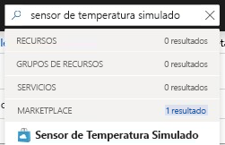
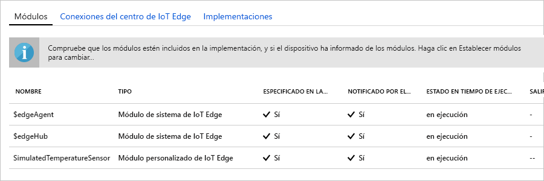

Una de las funcionalidades clave de Azure IoT Edge es que puede implementar código en dispositivos de IoT Edge desde la nube. Los **módulos de IoT Edge** son paquetes ejecutables que se implementan como contenedores. En esta sección, va a implementar un módulo pregenerado desde la [sección de módulos de IoT Edge de Azure Marketplace](https://azuremarketplace.microsoft.com/marketplace/apps/category/internet-of-things?page=1&subcategories=iot-edge-modules). 

El módulo que se implementa en esta sección simula un sensor y envía los datos generados. Este módulo es un fragmento de código útil para empezar a trabajar con IoT Edge porque se pueden usar los datos simulados para desarrollo y pruebas. Si desea ver exactamente lo que hace este módulo, puede ver el [código fuente del sensor de temperatura simulado](https://github.com/Azure/iotedge/blob/027a509549a248647ed41ca7fe1dc508771c8123/edge-modules/SimulatedTemperatureSensor/src/Program.cs). 

Para implementar el primer módulo desde Azure Marketplace, siga estos pasos:

1. En [Azure Portal](https://portal.azure.com), escriba **Sensor de temperatura simulado** en la búsqueda y abra el resultado de Marketplace.

   

2. Elija un dispositivo IoT Edge para recibir este módulo. En la página **Dispositivos de destino para el módulo de IoT Edge**, proporcione la siguiente información:

   1. **Suscripción**: seleccione la suscripción que contiene el centro de IoT que usa.

   2. **IoT Hub**: seleccione el nombre del centro de IoT que usa.

   3. **Nombre de dispositivo IoT Edge**: si usó el nombre de dispositivo sugerido anteriormente en este inicio rápido, escriba **myEdgeDevice**. También puede seleccionar **Buscar dispositivo** para elegir de una lista de dispositivos IoT Edge en el centro de IoT. 
   
   4. Seleccione **Crear**.

3. Ahora que eligió un módulo de IoT Edge en Azure Marketplace y un dispositivo IoT Edge para recibir el módulo, verá un asistente de tres pasos que lo ayudará a definir exactamente cómo se implementa el módulo. En el paso **Agregar módulos** del asistente, observe que el módulo**SimulatedTemperatureSensor** se rellena automáticamente. En los tutoriales, usará esta página para agregar otros módulos a la implementación. En este inicio rápido, basta con implementar este módulo. Seleccione **Siguiente** para pasar al próximo paso del asistente.

4. En el paso **Especificar rutas** del asistente, defina cómo se transmiten los mensajes entre los módulos y a IoT Hub. Para el inicio rápido, querrá que todos los mensajes de todos los módulos vayan a IoT Hub (`$upstream`). Si no se rellena automáticamente, agregue el código siguiente:

   ```json
    {
    "routes": {
        "route": "FROM /messages/* INTO $upstream"
        }
    }
   ```
   Luego, seleccione **Siguiente**.

5. En el paso **Revisar implementación** del asistente, puede obtener una vista previa del archivo JSON que define todos los módulos que se implementarán en el dispositivo IoT Edge. Observe que se incluye el módulo **SimulatedTemperatureSensor**, así como dos módulos de sistema adicionales llamados **edgeAgent** y **edgeHub**. Seleccione **Enviar** cuando termine de revisar.

   Cuando se envía una implementación nueva a un dispositivo IoT Edge, no se inserta nada en el dispositivo. En lugar de eso, el dispositivo consulta a IoT Hub de manera periódica para comprobar cualquier instrucción nueva. Si el dispositivo encuentra un manifiesto de implementación actualizado, usa la información sobre la nueva implementación para extraer las imágenes del módulo de la nube y, después, comienza a ejecutar localmente los módulos. Este proceso puede tardar unos minutos. 

6. Después de enviar los detalles de la implementación del módulo, el asistente lo lleva nuevamente a la página **IoT Edge** del centro de IoT. Seleccione el dispositivo en la lista de dispositivos IoT Edge para ver sus detalles. 

7. En la página de detalles del dispositivo, desplácese a la sección **Módulos**. Deben aparecer tres módulos: $edgeAgent, $edgeHub y SimulatedTemperatureSensor. Si uno o varios de los módulos aparecen como especificados en la implementación pero no informados por el dispositivo, significa que el dispositivo IoT Edge todavía los está iniciando. Espere unos instantes y seleccione **Actualizar** en la parte superior de la página. 

   
