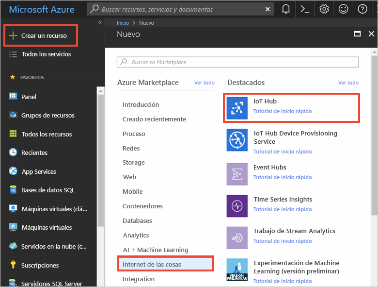
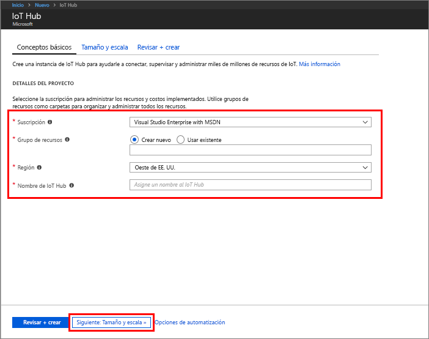
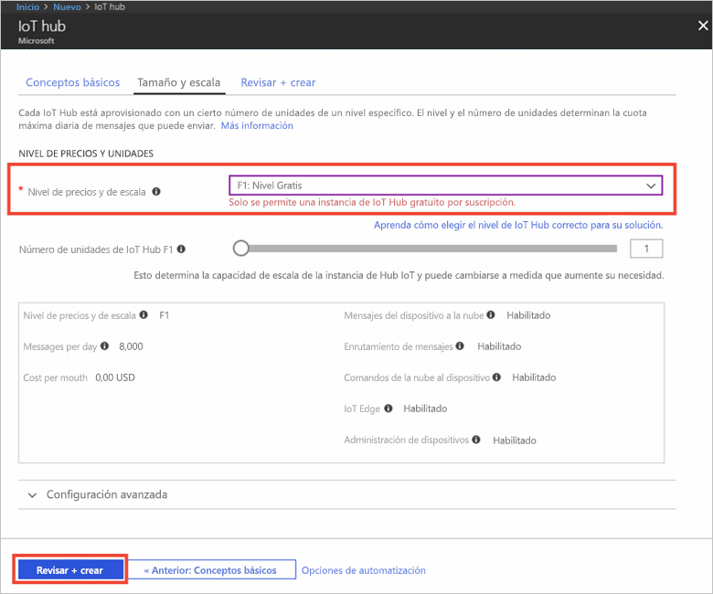

1. Inicie sesión en el [Azure Portal](https://portal.azure.com/).

2. Seleccione **Crear un recurso** > **Internet de las cosas** > **IoT Hub**.
   
    

3. En el panel **Centro de IoT**, escriba la información necesaria para su centro de IoT:

   * **Suscripción**: elija la suscripción que quiere usar para crear este IoT Hub.

   * **Grupo de recursos**: cree un grupo de recursos para hospedar el centro de IoT o use uno existente. Para más información, consulte [Administración de los recursos de Azure a través del Portal](../articles/azure-resource-manager/resource-group-portal.md).

   * **Región**: seleccione la ubicación más cercana a usted.

   * **Nombre**: cree un nombre para su centro de IoT. Si el nombre que escribe está disponible, aparece una marca de verificación verde.

   [!INCLUDE [iot-hub-pii-note-naming-hub](iot-hub-pii-note-naming-hub.md)]

   

4. Seleccione **Next: Size and scale** (Siguiente: tamaño y escala) para seguir creando su IoT Hub. 

5. Seleccione su **Nivel de precios y de escala**. En este artículo, seleccione el nivel **F1 - Free** (F1: gratis) si aún está disponible en la suscripción. Para más información, consulte la página de [precios de IoT Hub](https://azure.microsoft.com/pricing/details/iot-hub/).

   

6. Seleccione **Revisar + crear**.

7. Revise la información de IoT Hub y, a continuación, haga clic en **Crear**. El centro de IoT puede tardar varios minutos en crearse. Puede ver el progreso en el panel **Notificaciones**.