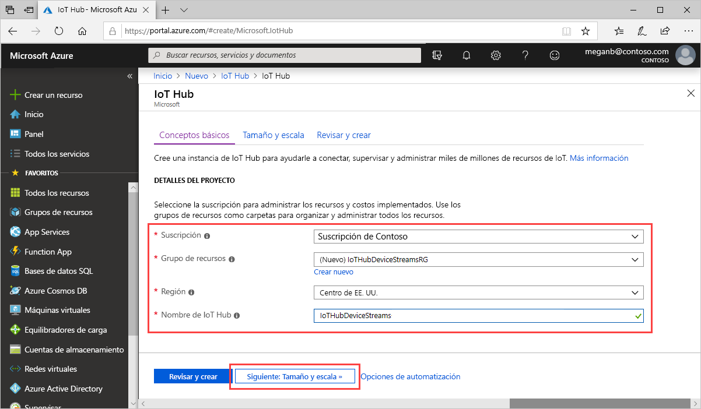
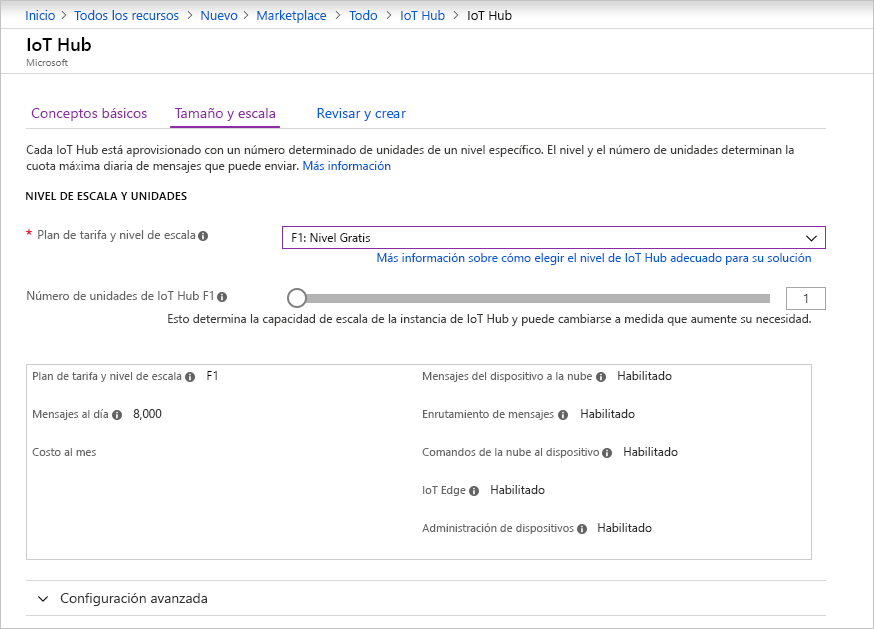

En esta sección se describe cómo crear un centro de IoT mediante [Azure Portal](https://portal.azure.com).

1. Inicie sesión en [Azure Portal](https://portal.azure.com).

1. Seleccione **Crear un recurso** y, después, escriba *IoT Hub* en el campo **Buscar en Marketplace**.

1. Seleccione **IoT Hub** en los resultados de la búsqueda y, después, haga clic en **Crear**.

1. En la pestaña **Datos básicos**, complete los campos como se indica a continuación:

   - **Suscripción**: seleccione la suscripción que quiera usar para el centro.

   - **Grupo de recursos**: seleccione un grupo de recursos o cree uno. Para crear uno, haga clic en **Crear** y escriba el nombre que quiera usar. Para usar un grupo de recursos existente, selecciónelo. Para más información, consulte [Administración de grupos de recursos de Azure Resource Manager](../articles/azure-resource-manager/management/manage-resource-groups-portal.md).

   - **Región**: seleccione la región a la que quiera ubicar el centro. Seleccione una región que admita la versión preliminar de los flujos de dispositivo de IoT Hub, bien **Centro de EE. UU.** o **EUAP de centro de EE. UU.** .

   - **Nombre de la instancia de IoT Hub**: escriba el nombre del centro. Este nombre debe ser único globalmente. Si el nombre que escribe está disponible, aparece una marca de verificación verde.

   

   [!INCLUDE [iot-hub-pii-note-naming-hub](iot-hub-pii-note-naming-hub.md)]

1. Seleccione **Siguiente: escala y tamaño** para seguir creando el centro.

   

   En **Escala y tamaño**, puede aceptar la configuración predeterminada y seleccionar **Revisar y crear** en la parte inferior. Considere las opciones siguientes:

   - **Plan de tarifa y escala**: nivel seleccionado. Seleccione uno de los niveles estándar (**S1**, **S2**o **S3**) o **F1: nivel Gratis**. Esta elección también puede determinarse por el tamaño de la flota y las cargas de trabajo que no sean de streaming que espera que haya en el centro (por ejemplo, los mensajes de telemetría). Por ejemplo, el nivel gratis está pensado para la prueba y evaluación. Permite la conexión de 500 dispositivos con el centro de IoT y hasta 8000 mensajes al día. Cada suscripción a Azure puede crear un centro de IoT en el nivel gratis. 

   - **Número de unidades de IoT Hub**: El número de mensajes que se permiten por unidad al día depende del plan de tarifa del centro. esta opción depende de la carga de trabajo que no sea de streaming que espera en el centro. Puede seleccionar 1 por ahora.

   - **Configuración avanzada** > **Particiones del dispositivo a la nube**: esta propiedad relaciona los mensajes del dispositivo a la nube con el número de lectores simultáneos de los mensajes. La mayoría de los centros solo necesitan cuatro particiones.

   Para más información acerca de las opciones del nivel, consulte [Elección del nivel adecuado de IoT Hub](../articles/iot-hub/iot-hub-scaling.md).

1. Haga clic en **Revisar y crear** para revisar sus selecciones. Los resultados serán similar a los siguientes:

   

1. Para crear el centro de IoT, seleccione **Crear**. El proceso tarda unos minutos.
