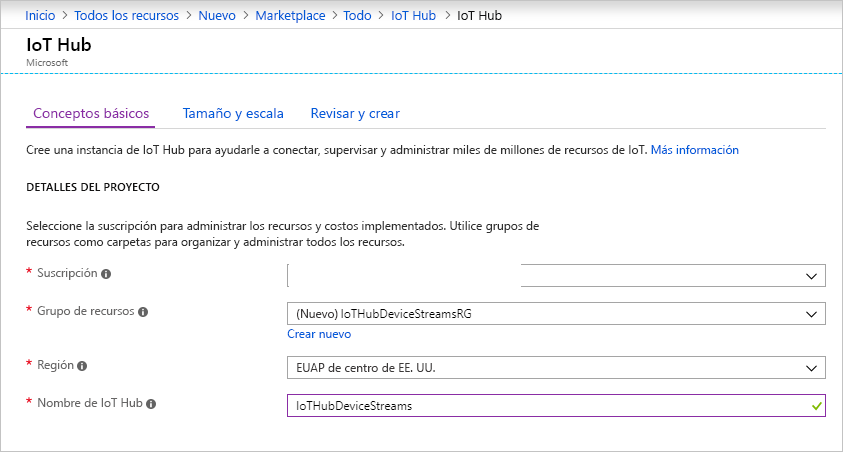

En esta sección se describe cómo crear un centro de IoT mediante [Azure Portal](https://portal.azure.com).

1. Inicie sesión en el [Azure Portal](https://portal.azure.com).

2. Elija **+ Crear un recurso** y, a continuación, **Internet de las cosas**.

3. Haga clic en **Centro de Iot** en la lista de la derecha. Verá la primera pantalla para crear un centro de IoT.

   

   Rellene los campos:

   **Suscripción**: seleccione la suscripción que se usará con su centro de IoT.

   **Grupo de recursos**: puede crear un grupo de recursos o use uno existente. Para crear uno, haga clic en **Create new** (Crear) y escriba el nombre que quiere usar. Para usar un grupo de recursos existente, haga clic en **Use existing** (Usar existente) y seleccione el grupo de recursos de la lista desplegable. Para más información, consulte [Administración de grupos de recursos de Azure Resource Manager](../articles/azure-resource-manager/manage-resource-groups-portal.md).

   **Región**: es la región en la que quiere ubicar el centro. Seleccione una región que admita la versión preliminar de los flujos de dispositivos IoT Hub, bien Centro de EE. UU. o EUAP de centro de EE. UU.

   **Nombre de la instancia de IoT Hub**: escriba el nombre de su instancia de IoT Hub. Este nombre debe ser único globalmente. Si el nombre que escribe está disponible, aparece una marca de verificación verde.

   [!INCLUDE [iot-hub-pii-note-naming-hub](iot-hub-pii-note-naming-hub.md)]

4. Haga clic en **Siguiente: Size and scale** (Siguiente: tamaño y escala) para seguir con la creación del centro de IoT.

   

   En esta pantalla, puede aceptar los valores predeterminados y hacer clic en **Review + create** (Revisar y crear) en la parte inferior.

   **Plan de tarifa y escala**: asegúrese de seleccionar uno de los niveles estándar (S1, S2, S3) o el nivel Gratis (F1). Esta elección también puede determinarse por el tamaño de la flota y las cargas de trabajo que no sea de streaming que espera que haya en el centro (por ejemplo, mensajes de telemetría). Por ejemplo, el nivel gratis está pensado para la prueba y evaluación. Permite la conexión de 500 dispositivos con el centro de IoT y hasta 8000 mensajes al día. Cada suscripción a Azure puede crear una instancia de IoT Hub en el nivel gratis. 

   **Unidades de IoT Hub**: esta opción depende de la carga de trabajo que no sea de streaming que espera que el centro; puede seleccionar uno por ahora.

   Para más información sobre las demás opciones del nivel, consulte la sección [Elección del nivel correcto de IoT Hub](../articles/iot-hub/iot-hub-scaling.md).

5. Haga clic en **Review + create** (Revisar y crear) para revisar sus selecciones. Verá algo parecido a esta pantalla.

   

6. Haga clic en **Create** (Crear) para crear el centro de IoT. Esta operación tarda unos minutos.
