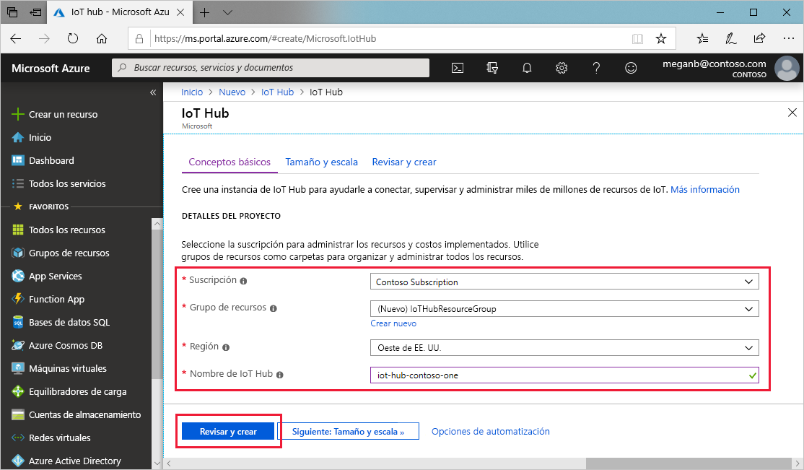
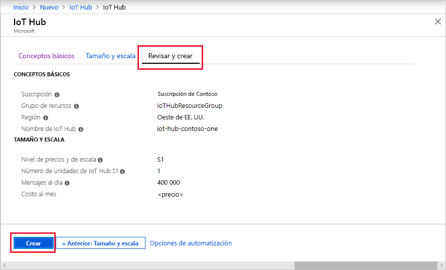

En esta sección se describe cómo crear un centro de IoT mediante [Azure Portal](https://portal.azure.com).

1. Inicie sesión en el [Azure Portal](https://portal.azure.com).

1. Seleccione **Crear un recurso** y, después, escriba *IoT Hub* en el campo **Buscar en Marketplace**.

1. Seleccione **IoT Hub** en los resultados de la búsqueda y, después, haga clic en **Crear**.

1. En la pestaña **Datos básicos**, complete los campos como se indica a continuación:

   - **Suscripción**: seleccione la suscripción que quiera usar para el centro.

   - **Grupo de recursos**: seleccione un grupo de recursos o cree uno. Para crear uno, haga clic en **Crear** y escriba el nombre que quiera usar. Para usar un grupo de recursos existente, selecciónelo. Para más información, consulte [Administración de grupos de recursos de Azure Resource Manager](../articles/azure-resource-manager/manage-resource-groups-portal.md).

   - **Región**: seleccione la región a la que quiera asignar el centro. Seleccione la ubicación más cercana a la suya.

   - **Nombre de la instancia de IoT Hub**: escriba el nombre del centro. Este nombre debe ser único globalmente. Si el nombre que escribe está disponible, aparece una marca de verificación verde.

   [!INCLUDE [iot-hub-pii-note-naming-hub](iot-hub-pii-note-naming-hub.md)]

   

1. Seleccione **Siguiente: escala y tamaño** para seguir creando el centro.

   

    Esta pantalla le permite configurar los valores siguientes:

    - **Plan de tarifa y escala**: nivel seleccionado. Puede elegir entre varios niveles, en función del número de características que desee, y del número de mensajes que envíe al día a través de su solución. El nivel gratis está pensado para la prueba y evaluación. Permite la conexión de 500 dispositivos con el centro de IoT y hasta 8000 mensajes al día. Cada suscripción a Azure puede crear una instancia de IoT Hub en el nivel gratis.

    - **Unidades de IoT Hub**: El número de mensajes que se permiten por unidad al día depende del plan de tarifa del centro. Por ejemplo, si quiere que el Centro de IoT admita la entrada de 700 000 mensajes, seleccione dos unidades del nivel S1.
    Para más información sobre las demás opciones del nivel, consulte la sección [Elección del nivel correcto de IoT Hub](../articles/iot-hub/iot-hub-scaling.md).

    - **Configuración avanzada** > **Particiones del dispositivo a la nube**: esta propiedad relaciona los mensajes del dispositivo a la nube con el número de lectores simultáneos de los mensajes. La mayoría de los centros solo necesitan cuatro particiones.

1. Para este tutorial, acepte las opciones predeterminadas y, después, seleccione **Revisar y crear** para revisar las opciones. Verá algo parecido a esta pantalla.

   

1. Seleccione **Crear** para crear un centro. Esta operación tarda unos minutos.
