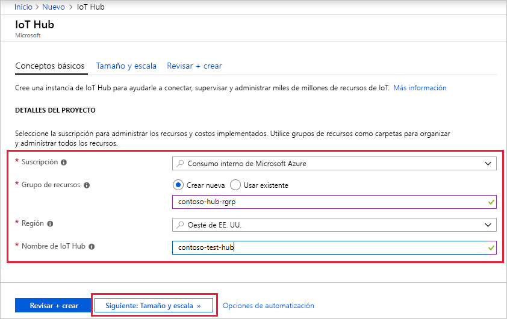
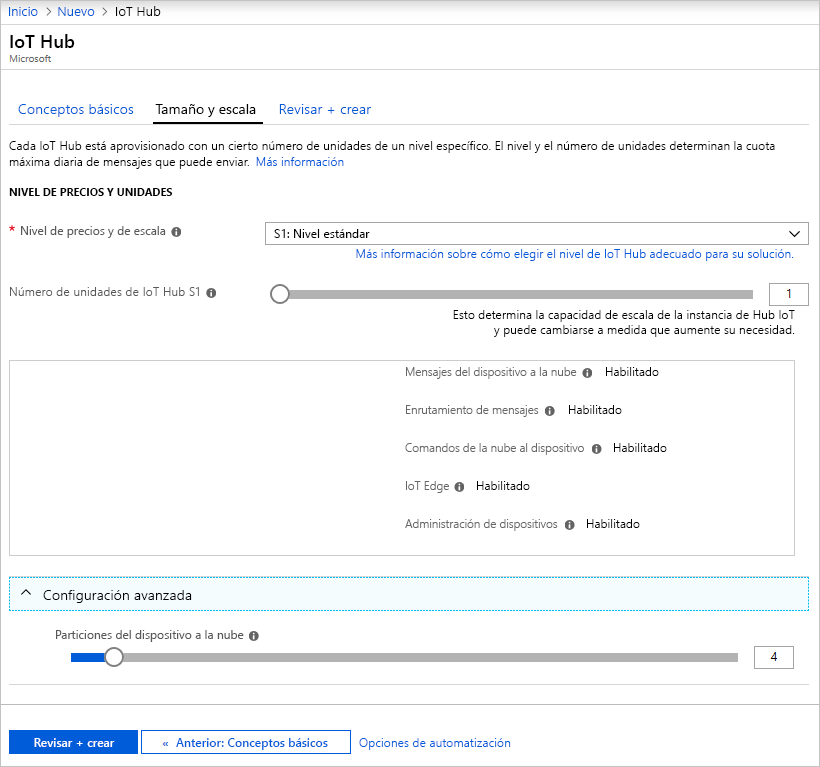
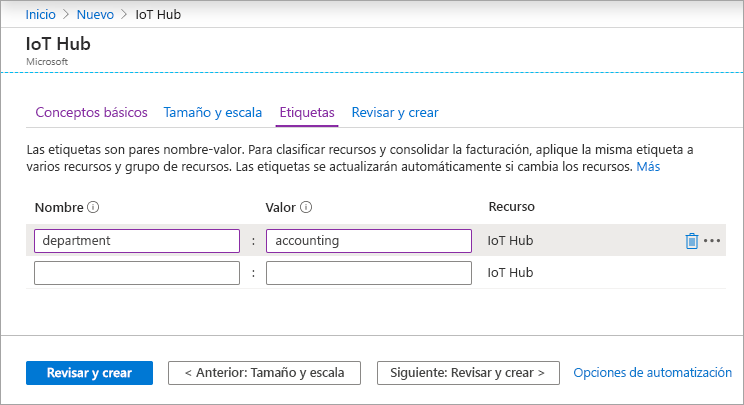
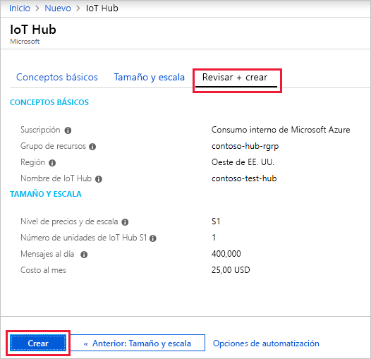

En esta sección se describe cómo crear un centro de IoT mediante [Azure Portal](https://portal.azure.com).

1. Inicie sesión en [Azure Portal](https://portal.azure.com).

1. En la página de inicio de Azure, seleccione **+ Crear un recurso** y, después, escriba *IoT Hub* en el campo **Buscar en Marketplace**.

1. Seleccione **IoT Hub** en los resultados de la búsqueda y, después, haga clic en **Crear**.

1. En la pestaña **Datos básicos**, complete los campos como se indica a continuación:

   - **Suscripción**: seleccione la suscripción que quiera usar para el centro.

   - **Grupo de recursos**: seleccione un grupo de recursos o cree uno. Para crear uno, haga clic en **Crear** y escriba el nombre que quiera usar. Para usar un grupo de recursos existente, selecciónelo. Para más información, consulte [Administración de grupos de recursos de Azure Resource Manager](../articles/azure-resource-manager/management/manage-resource-groups-portal.md).

   - **Región**: seleccione la región a la que quiera asignar el centro. Seleccione la ubicación más cercana a la suya. Algunas características, como los [flujos de dispositivo de IoT Hub](../articles/iot-hub/iot-hub-device-streams-overview.md), solo están disponibles en regiones específicas. Para ver estas características limitadas, debe seleccionar una de las regiones admitidas.

   - **Nombre de la instancia de IoT Hub**: escriba el nombre del centro. Este nombre debe ser único globalmente. Si el nombre que escribe está disponible, aparece una marca de verificación verde.

   [!INCLUDE [iot-hub-pii-note-naming-hub](iot-hub-pii-note-naming-hub.md)]

   

1. Seleccione **Siguiente: escala y tamaño** para seguir creando el centro.

   

   Puede aceptar la configuración predeterminada aquí. Si lo desea, puede modificar cualquiera de los siguientes campos: 

    - **Plan de tarifa y escala**: nivel seleccionado. Puede elegir entre varios niveles, en función del número de características que desee, y del número de mensajes que envíe al día a través de su solución. El nivel gratis está pensado para la prueba y evaluación. Permite la conexión de 500 dispositivos con el centro de IoT y hasta 8000 mensajes al día. Cada suscripción a Azure puede crear un centro de IoT en el nivel gratis. 

      Si está trabajando con un inicio rápido de flujos de dispositivo de IoT Hub, seleccione el nivel gratuito.

    - **Unidades de IoT Hub**: El número de mensajes que se permiten por unidad al día depende del plan de tarifa del centro. Por ejemplo, si quiere que el Centro de IoT admita la entrada de 700 000 mensajes, seleccione dos unidades del nivel S1.
    Para más información sobre las demás opciones del nivel, consulte la sección [Elección del nivel correcto de IoT Hub](../articles/iot-hub/iot-hub-scaling.md).

    - **Azure Security Center**: Actívelo para agregar un nivel adicional de protección ante amenazas en IoT y en los dispositivos. Esta opción no está disponible para los centros de conectividad del nivel gratuito. Para más información acerca de esta característica, consulte [Azure Security Center para IoT](https://docs.microsoft.com/azure/asc-for-iot/).

    - **Configuración avanzada** > **Particiones del dispositivo a la nube**: esta propiedad relaciona los mensajes del dispositivo a la nube con el número de lectores simultáneos de los mensajes. La mayoría de los centros solo necesitan cuatro particiones.

1.  Seleccione **Siguiente: Etiquetas** para pasar a la pantalla siguiente.

    Las etiquetas son pares nombre-valor. Puede asignar la misma etiqueta a varios recursos y grupos de recursos para clasificar los recursos y consolidar la facturación. Para más información, consulte [Uso de etiquetas para organizar los recursos de Azure](../articles/azure-resource-manager/management/tag-resources.md).

    

1.  Seleccione **Siguiente: Revisar y crear** para revisar sus selecciones. Verá algo parecido a esta pantalla, pero con los valores que ha seleccionado al crear el centro. 

    

1.  Seleccione **Crear** para crear un centro. Esta operación tarda unos minutos.
