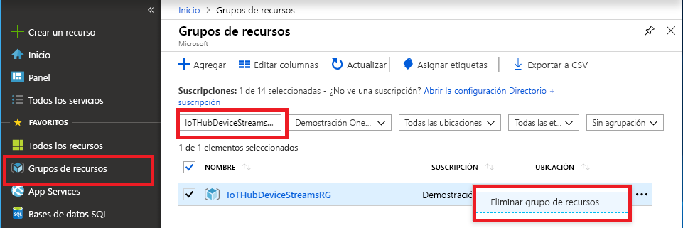

Si va a seguir con el siguiente artículo recomendado, puede mantener los recursos que ya ha creado y volverlos a utilizar.

En caso contrario, puede eliminar los recursos de Azure que creó en este artículo para evitar gastos.

> [!IMPORTANT]
> La eliminación de un grupo de recursos es irreversible. El grupo de recursos y todos los recursos contenidos en él se eliminan permanentemente. Asegúrese de no eliminar por accidente el grupo de recursos o los recursos equivocados. Si ha creado el centro de IoT en un grupo de recursos ya existente que tiene recursos que desea conservar, elimine solo el recurso del centro de IoT en sí en lugar de eliminar todo el grupo de recursos.
>

Para eliminar un grupo de recursos por el nombre:

1. Inicie sesión en [Azure Portal](https://portal.azure.com) y después seleccione **Grupos de recursos**.

1. En el cuadro **Filtrar por nombre**, escriba el nombre del grupo de recursos que contiene el centro de IoT.

1. A la derecha del grupo de recursos, en la lista de resultados, seleccione los puntos suspensivos ( **...** ) y, después, **Eliminar grupo de recursos**.

    

1. Para confirmar la eliminación del grupo de recursos, vuelva a escribir el nombre de este y, a continuación, seleccione **Eliminar**. Transcurridos unos instantes, el grupo de recursos y todos los recursos que contiene se eliminan.
