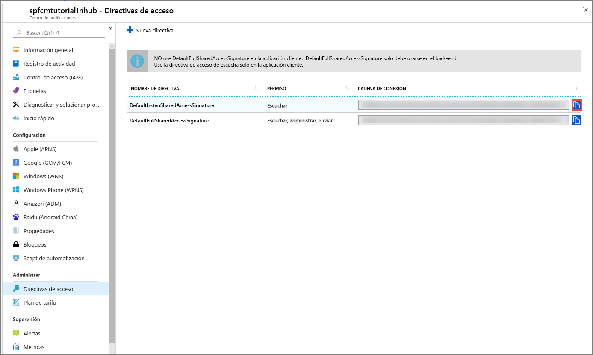

1. Inicie sesión en el [Azure Portal](https://portal.azure.com).

2. Seleccione **Crear un recurso** > **Móvil** > **Centro de notificaciones**.

      

3. En el cuadro **Centro de notificaciones**, escriba un nombre único. Seleccione el elemento **Región**, **Suscripción** y **Grupo de recursos** (si dispone ya de uno).

      Si aún no tiene un espacio de nombres de Service Bus, puede usar el predeterminado, que se crea en función del nombre del centro (si está disponible el espacio de nombres).

      Si ya tiene un espacio de nombres de Service Bus donde crear el centro, siga estos pasos:

     a. En el área **Espacio de nombres**, seleccione el vínculo **Seleccionar uno existente**.

    b. Seleccione **Crear**.

    

4. Seleccione **Notificaciones** (icono de campana) y, luego, **Go to resource** (Ir al recurso).

      
5. Seleccione **Directivas de acceso** en la lista. Anote las dos cadenas de conexión disponibles. Las necesitará para gestionar las notificaciones push más tarde.

      >[!IMPORTANT]
      >**NO** use la clave DefaultFullSharedAccessSignature en su aplicación. Está pensada para usarse solamente en el back-end.
      >

      
