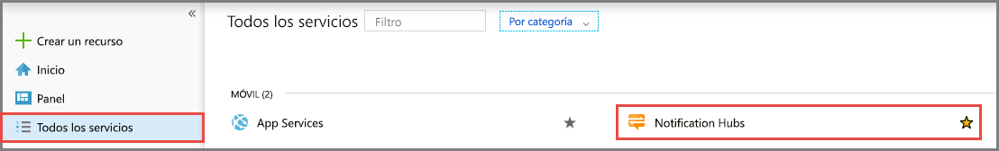
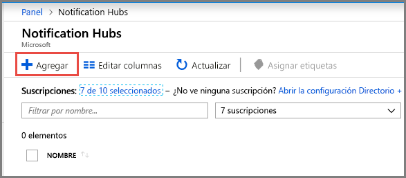
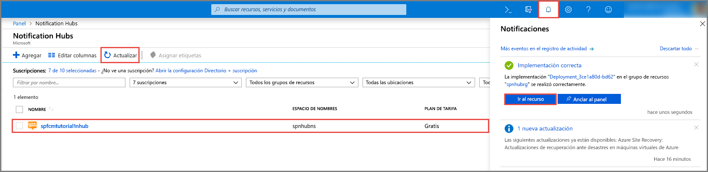

1. Inicie sesión en el [Azure Portal](https://portal.azure.com).

1. Seleccione **Todos los servicios** en el menú de la izquierda y seleccione **Notification Hubs** en la sección **Móvil**. Seleccione el icono de estrella junto al nombre del servicio para agregarlo a la sección **FAVORITOS** en el menú de la izquierda. Cuando se agrega **Notification Hubs** a **FAVORITOS**, selecciónelo en el menú de la izquierda.

      

1. En la página **Notification Hubs**, seleccione **Agregar** en la barra de herramientas.

      

1. En la página **Notification Hubs**, realice los pasos siguientes:

    1. Escriba un nombre en el **centro de notificaciones**.  

    1. Escriba un nombre en **Crear un nuevo espacio de nombres**. Un espacio de nombres contiene uno o más centros.

    1. Seleccione un valor en el cuadro de lista desplegable **Ubicación**. Este valor especifica la ubicación en la que quiere crear el centro.

    1. Seleccione un grupo de recursos existente en **Grupo de recursos** o cree un nombre para el nuevo grupo.

    1. Seleccione **Crear**.

        

1. Seleccione **Notificaciones** (el icono de campana) y, luego, **Ir al recurso**. También puede actualizar la lista en la página **Notification Hubs** y seleccionar su centro.

      

1. Seleccione **Directivas de acceso** en la lista. Observe que las dos cadenas de conexión están disponibles. Las necesitará más adelante para gestionar las notificaciones push.

      >[!IMPORTANT]
      >*No* use la directiva **DefaultFullSharedAccessSignature** en la aplicación. Está pensada para usarse solamente en el back-end.
      >

      
