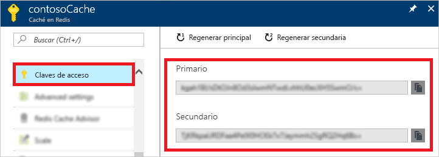
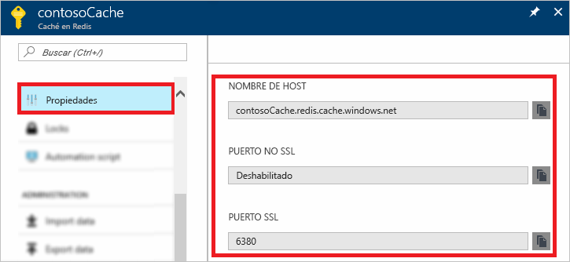

### Recuperación del nombre de host, los puertos y las claves de acceso mediante Azure Portal

Al establecer conexión con la instancia de Azure Redis Cache, los clientes de dicha caché necesitan el nombre de host, los puertos y una clave para la caché. Es posible que algunos clientes utilicen nombres ligeramente diferentes para estos elementos. Puede recuperar esta información en Azure Portal.

#### Recuperación de las claves de acceso y el nombre de host

1. Para recuperar las claves de acceso mediante [Azure Portal](https://portal.azure.com), vaya a la memoria caché y seleccione **Claves de acceso**. 

    

2. Para recuperar el nombre de host y los puertos, seleccione **Propiedades**.

    

