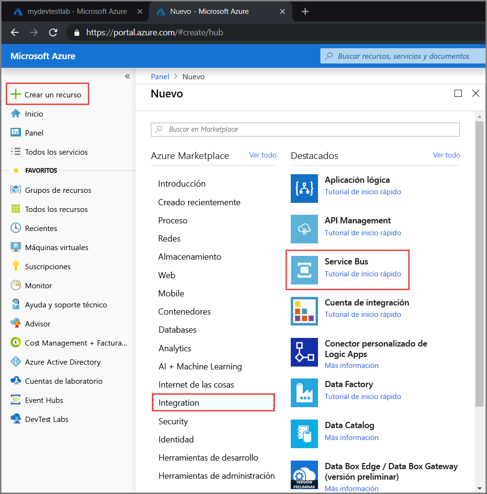
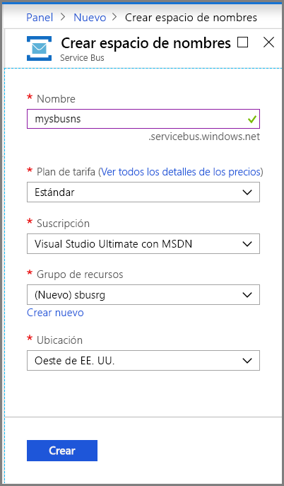
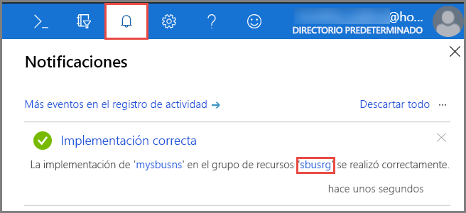
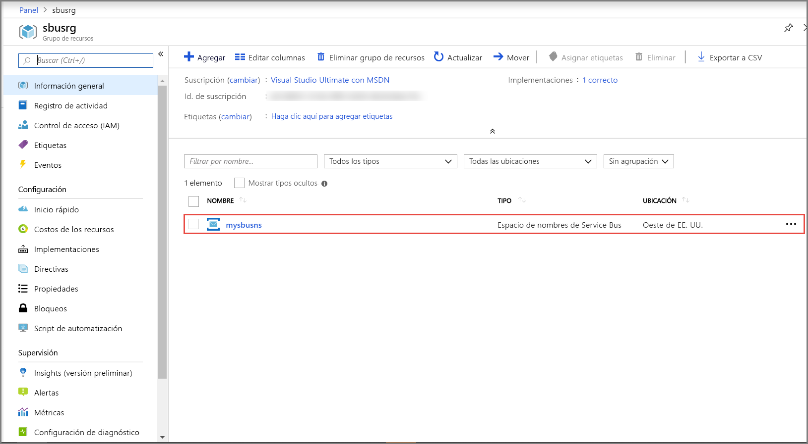
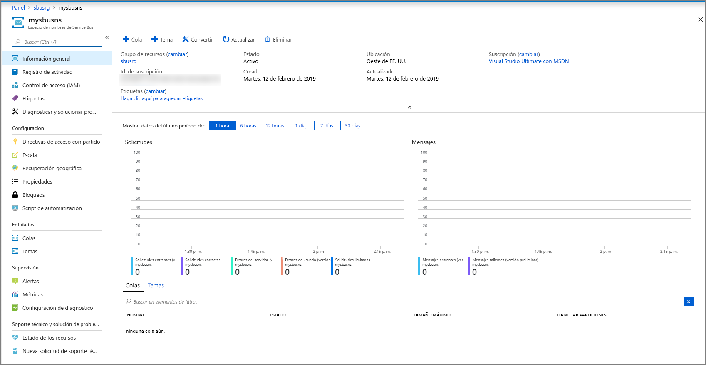
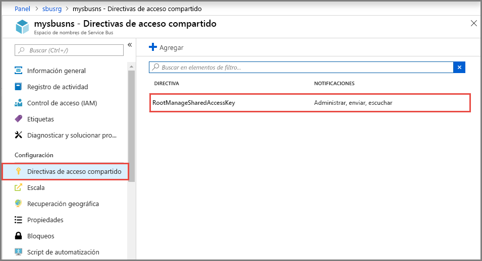

## Creación de un espacio de nombres en Azure Portal
Para empezar a usar entidades de mensajería de Service Bus en Azure, primero hay que crear un espacio de nombres con un nombre que sea único en Azure. Un espacio de nombres proporciona un contenedor con un ámbito para el desvío de recursos de Service Bus en la aplicación.

Para crear un espacio de nombres:

1. Inicie sesión en el [Portal de Azure](https://portal.azure.com)
2. En el panel de navegación izquierdo del portal, seleccione sucesivamente **+ Crear un recurso**, **Integración** y **Service Bus**.

    
3. En el cuadro de diálogo **Crear espacio de nombres**, realice los pasos siguientes: 
    1. Escriba **nombre para el espacio de nombres**. El sistema realiza la comprobación automáticamente para ver si el nombre está disponible. Para obtener una lista de las reglas para asignar nombres a los espacios de nombres, consulte [Creación de API REST de espacio de nombres](/rest/api/servicebus/create-namespace).
    2. Seleccione el plan de tarifa (Básico, Estándar o Premium) para el espacio de nombres. Si desea usar [temas y suscripciones](../articles/service-bus-messaging/service-bus-queues-topics-subscriptions.md#topics-and-subscriptions), elija Estándar o Premium. No se admiten temas o suscripciones en el plan de tarifas Básico.
    3. Si ha seleccionado el plan de tarifa **Premium**, siga estos pasos: 
        1. Especifique el número de **unidades de mensajería**. El plan Premium proporciona aislamiento de recursos en el nivel de CPU y memoria para que cada carga de trabajo se ejecute de forma aislada. Este contenedor de recursos se llama unidad de mensajería. A cada espacio de nombres prémium se le asigna al menos una unidad de mensajería. Puede seleccionar 1, 2 o 4 unidades de mensajería para cada espacio de nombres Premium de Service Bus. Para más información, consulte [Mensajería prémium de Service Bus](../articles/service-bus-messaging/service-bus-premium-messaging.md).
        2. Especifique si desea que el espacio de nombres tenga **redundancia de zona**. La redundancia de zona propaga las réplicas en las zonas de disponibilidad de una región para mejorar la disponibilidad sin costo adicional. Para más información, consulte [Zonas de disponibilidad en Azure](../articles/availability-zones/az-overview.md).
    4. En **Suscripción**, elija la suscripción de Azure en la que se va a crear el espacio de nombres.
    5. En **Grupo de recursos**, elija un grupo de recursos existente en el que residirá el espacio de nombres o cree uno.      
    6. En **Ubicación**, elija la región donde se debe hospedar el espacio de nombres.
    7. Seleccione **Crear**. El sistema crea ahora el espacio de nombres del servicio y lo habilita. Es posible que tenga que esperar algunos minutos mientras el sistema realiza el aprovisionamiento de los recursos para la cuenta.
   
        
4. Confirme que el espacio de nombres de Service Bus se ha implementado correctamente. Para ver las notificaciones, seleccione el **icono de campana (Alertas)** en la barra de herramientas. Seleccione el **nombre del grupo de recursos** en la notificación, tal como se muestra en la imagen. Verá el grupo de recursos que contiene el espacio de nombres de Service Bus.

    
5. En la página **Grupo de recursos** del grupo de recursos, seleccione el **espacio de nombres de Service Bus**. 

    
6. Verá la página principal del espacio de nombres de Service Bus. 

    

## Obtención de la cadena de conexión 
La creación un nuevo espacio de nombres genera automáticamente una regla de firma de acceso compartido (SAS) inicial con un par asociado de claves principal y secundaria en el que ambas conceden control total sobre todos los aspectos del espacio de nombres. Para obtener información acerca de cómo crear reglas adicionales con derechos más restringidos para remitentes y destinatarios normales, consulte [Autenticación y autorización de Service Bus](../articles/service-bus-messaging/service-bus-authentication-and-authorization.md). Para copiar las claves principal y secundaria del espacio de nombres, siga estos pasos: 

1. Haga clic en **Todos los recursos** y, después, en el nombre del espacio de nombres recién creado.
2. En la ventana del espacio de nombres, haga clic en **Directivas de acceso compartido**.
3. En la pantalla **Directivas de acceso compartido**, haga clic en **RootManageSharedAccessKey**.
   
    
4. En la ventana **Directiva: RootManageSharedAccessKey**, haga clic en el botón Copiar que hay junto a **Cadena de conexión principal** para copiar la cadena de conexión en el portapapeles para su uso posterior. Pegue este valor en el Bloc de notas o cualquier otra ubicación temporal.
   
    
5. Repita el paso anterior, copie y pegue el valor de **clave principal** en una ubicación temporal para su uso posterior.

<!--Image references-->

