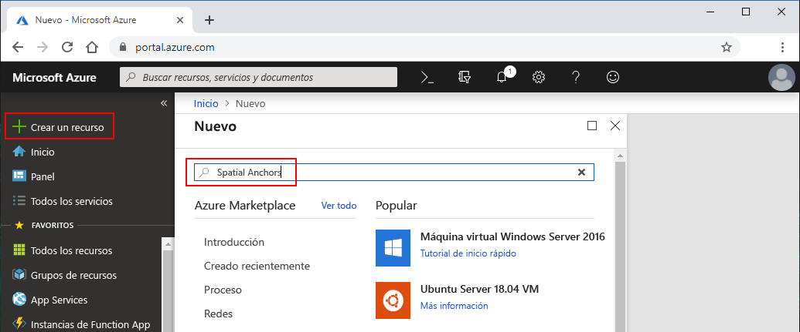
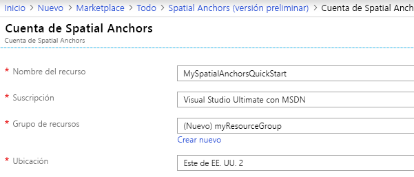
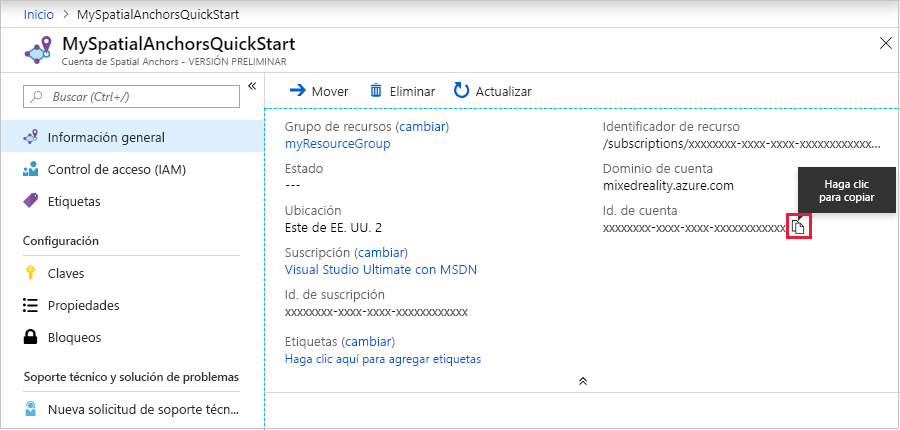

## Creación de un recurso de Spatial Anchors

1. Acceda a <a href="https://portal.azure.com" target="_blank">Azure Portal</a>.

2. En el menú izquierdo de Azure Portal, seleccione **Crear un recurso**.

3. Busque "Spatial Anchors" en la barra de búsqueda.

   

4. Seleccione **Spatial Anchors (versión preliminar)** para abrir un cuadro de diálogo y seleccione **Crear**.

5. En el formulario **Spatial Anchors Account** (Cuenta de Spatial Anchors):

   1. Especifique un nombre de recurso único.
   2. Seleccione la suscripción a la que desea asociar el recurso.
   3. Para crear un grupo de recursos, seleccione **Crear nuevo**, use el nombre de grupo de recursos **myResourceGroup** y seleccione **Aceptar**.
      [!INCLUDE [resource group intro text](resource-group.md)]
   4. Seleccione la ubicación (región) donde se colocará el recurso.
   5. Seleccione **New** (Nuevo) para empezar a crear el recurso.

   

6. Una vez creado el recurso correctamente, se pueden ver sus propiedades. Anote el valor de **Id. de cuenta** del recurso porque será necesario más adelante.

   

7. En **Settings** (Configuración), seleccione **Key** (Clave) y anote el valor de **Primary key** (Clave principal). Este valor es `Account Key` y se usará más adelante.

   
