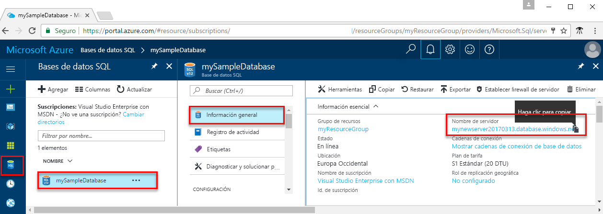

<!-- sql-database-connect-query-prerequisites-server-connection-info-includes.md 

## Get SQL server connection information
-->

Obtención de la información de conexión necesaria para conectarse a Azure SQL Database. En los procedimientos siguientes, necesitará el nombre completo del servidor, el nombre de la base de datos y la información de inicio de sesión.

1. Inicie sesión en el [Azure Portal](https://portal.azure.com/).

1. Seleccione **SQL Database** en el menú de la izquierda y seleccione la base de datos en la página **SQL Database**.

1. En la página **Introducción** de la base de datos, revise el nombre completo del servidor que aparece junto a **Nombre de servidor**. Para copiar el nombre del servidor, mantenga el cursor sobre él y seleccione el icono **Copiar**.  

Si olvida la información de inicio de sesión, seleccione el nombre del servidor para abrir la página **SQL Server**. Aquí puede ver el nombre del **administrador del servidor** y seleccionar **Restablecer contraseña** si es necesario.