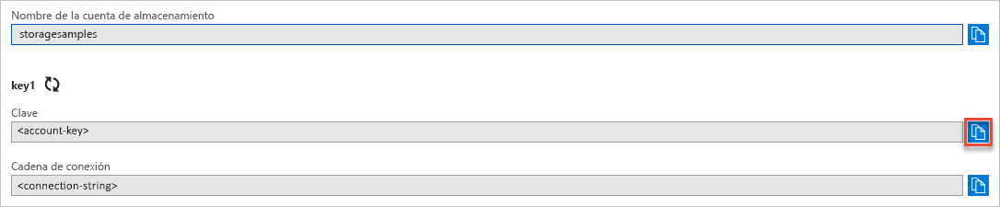

## Copia de las credenciales desde Azure Portal

La aplicación de ejemplo debe autorizar el acceso a su cuenta de almacenamiento. Proporcione las credenciales de la cuenta de almacenamiento a la aplicación en forma de una cadena de conexión. Para ver las credenciales de la cuenta de almacenamiento:

1. Acceda a [Azure Portal](https://portal.azure.com).
2. Busque su cuenta de almacenamiento.
3. En la sección **Configuración** de la información general de la cuenta de almacenamiento, seleccione **Claves de acceso**. Se muestran sus claves de acceso a la cuenta y la cadena de conexión.
4. Anote el nombre de la cuenta de almacenamiento, lo necesitará para la autorización.   
5. Busque el valor de **Clave** en **key1** y haga clic en el botón **Copiar** para copiar la clave de la cuenta.

    
