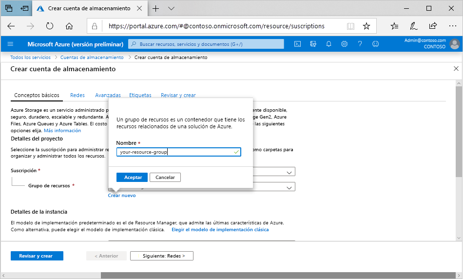

Para crear una cuenta de almacenamiento de uso general v2 en Azure Portal, siga estos pasos:

1. En el menú de Azure Portal, seleccione **Todos los servicios**. En la lista de recursos, escriba **Cuentas de almacenamiento**. Cuando comience a escribir, la lista se filtrará en función de la entrada. Seleccione **Cuentas de almacenamiento**.
2. En la ventana **Cuentas de almacenamiento** que aparece, elija **Agregar**.
3. Seleccione la suscripción en la que se va a crear la cuenta de almacenamiento.
4. En el campo **Grupo de recursos**, haga clic en **Crear nuevo**. Escriba un nombre para el nuevo grupo de recursos, como se muestra en la siguiente imagen.

    

5. Después, escriba un nombre para la cuenta de almacenamiento. El nombre que elija debe ser único en Azure. El nombre debe tener también una longitud de entre 3 y 24 caracteres y solo puede contener números y letras minúsculas.
6. Seleccione una ubicación para la cuenta de almacenamiento o utilice la ubicación predeterminada.
7. Deje estos campos con sus valores predeterminados:

   |Campo  |Value  |
   |---------|---------|
   |Modelo de implementación     |Resource Manager         |
   |Rendimiento     |Estándar         |
   |Tipo de cuenta     |StorageV2 (uso general v2)         |
   |Replicación     |Almacenamiento con redundancia geográfica con acceso de lectura (RA-GRS).         |
   |Nivel de acceso     |Acceso frecuente         |

8. Si planea usar [Azure Data Lake Storage](https://azure.microsoft.com/services/storage/data-lake-storage/), elija la pestaña **Opciones avanzadas** y, después, en **Espacio de nombres jerárquico**, seleccione **Habilitado**.
9. Seleccione **Revisar y crear** para revisar la configuración de la cuenta de almacenamiento y crear la cuenta.
10. Seleccione **Crear**.

Para obtener más información sobre los tipos de cuentas de almacenamiento y otros parámetros de la cuenta de almacenamiento, consulte [Introducción a las cuentas de Azure Storage](https://docs.microsoft.com/azure/storage/common/storage-account-overview). Para más información sobre los grupos de recursos, consulte [Información general de Azure Resource Manager](https://docs.microsoft.com/azure/azure-resource-manager/resource-group-overview). 
