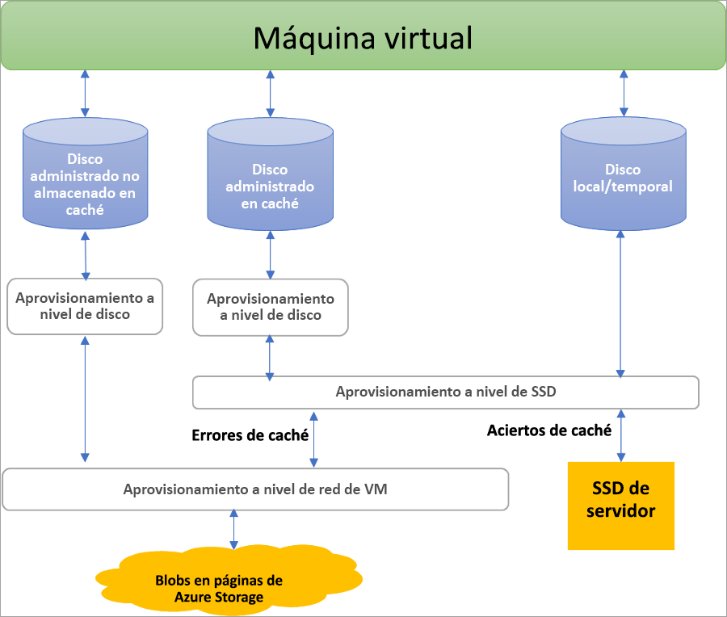

## Ventajas de los discos administrados

Vamos a examinar algunas de las ventajas que se obtienen al usar discos administrados.

### Mayor durabilidad y disponibilidad

Los discos administrados están diseñados para ofrecer una disponibilidad del 99,999 %. Para conseguir esto, proporcionan tres réplicas de los datos, lo que permite una gran durabilidad. Si una o incluso dos réplicas experimentan problemas, las réplicas restantes garantizan la persistencia de los datos y una gran tolerancia a errores. Esta arquitectura ha contribuido a que Azure destaque en el sector por ofrecer, de manera constante, durabilidad de nivel empresarial para discos de infraestructura como servicio (IaaS), con una tasa de error anualizada del 0 %.

### La implementación de las máquina virtuales es simple y escalable

Con discos administrados, puede crear hasta 50 000 **discos** de máquina virtual de un tipo en una suscripción por región, lo que le permite crear miles de **máquinas virtuales** en una sola suscripción. Esta característica también aumenta la escalabilidad de los [conjuntos de escalado de máquina virtual](../articles/virtual-machine-scale-sets/virtual-machine-scale-sets-overview.md), ya que permite crear hasta 1000 máquinas virtuales en un conjunto de escalado de máquina virtual con una imagen de Marketplace.

### Integración con conjuntos de disponibilidad

Los discos administrados se integran con conjuntos de disponibilidad para garantizar que los discos de [máquinas virtuales de un conjunto de disponibilidad](../articles/virtual-machines/windows/manage-availability.md#use-managed-disks-for-vms-in-an-availability-set) están suficientemente aislados entre sí para evitar un único punto de error. Los discos se colocan automáticamente en diferentes unidades de escalado de almacenamiento (marcas). Si se produce un error en una marca debido a un error de hardware o software, solo dejarán de funcionar las instancias de máquina virtual con discos de dichas marcas. Por ejemplo, suponga que tiene una aplicación que se ejecuta en cinco máquinas virtuales y estas están en un conjunto de disponibilidad. No todos los discos de dichas máquinas virtuales se almacenarán en la misma marca, por lo que, si se produce un error en una, no se detiene la ejecución de las restantes instancias de la aplicación.

### Integración con Availability Zones

Los discos administrados admiten [Availability Zones](../articles/availability-zones/az-overview.md), que son una oferta de alta disponibilidad que protege las aplicaciones de los errores del centro de datos. Las zonas de disponibilidad son ubicaciones físicas exclusivas dentro de una región de Azure. Cada zona de disponibilidad consta de uno o varios centros de datos equipados con alimentación, refrigeración y redes independientes. Para garantizar la resistencia, hay tres zonas independientes como mínimo en todas las regiones habilitadas. Con las zonas de disponibilidad, Azure ofrece el mejor Acuerdo de Nivel de Servicio del sector de tiempo de actividad de máquina virtual, con un 99,99 %.

### Soporte técnico de Azure Backup

Para protegerse frente a desastres regionales, se puede usar [Azure Backup](../articles/backup/backup-overview.md) para crear un trabajo de copia de seguridad con copias de seguridad basadas en el tiempo y directivas de retención de copia de seguridad. Esto le permite realizar restauraciones sencillas de máquinas virtuales a voluntad. Azure Backup admite la copia de seguridad y la restauración de discos administrados. [Más información](../articles/backup/backup-support-matrix-iaas.md) sobre la compatibilidad con la copia de seguridad de máquinas virtuales de Azure.

### Control de acceso pormenorizado

Puede usar el [control de acceso basado en rol de Azure (RBAC)](../articles/role-based-access-control/overview.md) para asignar a uno o varios usuarios permisos concretos a un disco administrado. Los discos administrados exponen varias operaciones, entre las que se incluyen la lectura, la escritura (creación o actualización), la eliminación y la recuperación de un [identificador URI de la firma de acceso compartido (SAS)](../articles/storage/common/storage-dotnet-shared-access-signature-part-1.md) para el disco. Puede conceder acceso solo a las operaciones necesarias para que una persona pueda realizar su trabajo. Por ejemplo, si no desea que una persona copie un disco administrado a una cuenta de almacenamiento, puede decidir no conceder acceso a la acción de exportación de dicho disco administrado. De igual forma, si no desea que una persona use URI de SAS para copiar un disco administrado, puede elegir no conceder dicho permiso al disco administrado.

### Carga de un disco duro virtual

 La carga directa facilita la transferencia de un disco duro virtual a un disco administrado de Azure. Anteriormente, había que seguir un proceso más complicado que incluía el almacenamiento provisional de los datos en una cuenta de almacenamiento. Ahora, hay que dar menos pasos. Es más fácil cargar máquinas virtuales locales en Azure, cargarlas en discos administrados grandes y el proceso de copia de seguridad y restauración se simplifica. También reduce los costos, ya que permite cargar los datos en discos administrados directamente sin necesidad de conectarlos a máquinas virtuales. Puede usar la carga directa para cargar discos duros virtuales de un máximo de 32 TiB.

 Para aprender a transferir un disco duro virtual a Azure, consulte los artículos acerca de la [CLI](../articles/virtual-machines/linux/disks-upload-vhd-to-managed-disk-cli.md) o de [PowerShell](../articles/virtual-machines/windows/disks-upload-vhd-to-managed-disk-powershell.md).

## Cifrado

Los discos administrados ofrecen dos tipos diferentes de cifrado. El primero de ellos es Storage Service Encryption (SSE), que se realiza mediante el servicio de almacenamiento. El segundo es Azure Disk Encryption (ADE), que se puede habilitar en los discos de datos y del sistema operativo de las máquinas virtuales.

### Cifrado del servidor

[Azure Storage Service Encryption](../articles/virtual-machines/windows/disk-encryption.md) proporciona cifrado en reposo y protege sus datos con el fin de cumplir con los compromisos de cumplimiento y seguridad de su organización. Storage Service Encryption está habilitado de forma predeterminada para todos los discos administrados, instantáneas e imágenes en todas las regiones donde hay discos administrados. Puede permitir que Azure administre sus claves, que son claves administradas por la plataforma, o puede administrar las claves por su cuenta, ya que son claves administradas por el cliente (versión preliminar). Visite la [página de preguntas más frecuentes sobre discos administrados](../articles/virtual-machines/windows/faq-for-disks.md#managed-disks-and-storage-service-encryption) para obtener más detalles.

### Azure Disk Encryption

Azure Disk Encryption le permite cifrar los discos de datos y del sistema operativo usados por una máquina virtual de IaaS. Este cifrado incluye discos administrados. Para Windows, las unidades se cifran mediante la tecnología de cifrado de BitLocker estándar del sector. Para Linux, los discos se cifran mediante la tecnología DM-Crypt. El proceso de cifrado se integra con Azure Key Vault para permitirle controlar y administrar las claves de cifrado del disco. Para más información, consulte [Azure Disk Encryption para máquinas virtuales IaaS](../articles/security/azure-security-disk-encryption-overview.md).

## Roles de disco

Hay tres roles principales de disco en Azure: el disco de datos, el disco del sistema operativo y el disco temporal. Estos roles se asignan a los discos que están conectados a la máquina virtual.

### Disco de datos

Un disco de datos es un disco administrado que se asocia a una máquina virtual para almacenar datos de aplicaciones u otros datos que necesita mantener. Los discos de datos se registran como unidades SCSI y se etiquetan con una letra elegida por usted. Cada disco de datos tiene una capacidad máxima de 32767 gibibytes (GiB). El tamaño de la máquina virtual determina cuántos discos de datos puede conectar y el tipo de almacenamiento que puede usar para hospedar los discos.

### Disco del sistema operativo

Cada máquina virtual tiene un disco de sistema operativo acoplado. Ese disco del sistema operativo tiene un sistema operativo instalado previamente, que se seleccionó cuando se creó la máquina virtual. Este disco contiene el volumen de arranque.

Su capacidad máxima es de 2048 GiB.

### Disco temporal

Cada máquina virtual contiene un disco temporal, que no es un disco administrado. El disco temporal proporciona almacenamiento a corto plazo para aplicaciones y procesos, y está destinado únicamente a almacenar datos como archivos de paginación o de intercambio. Los datos del disco temporal pueden perderse durante un [evento de mantenimiento](../articles/virtual-machines/windows/manage-availability.md?toc=%2fazure%2fvirtual-machines%2fwindows%2ftoc.json#understand-vm-reboots---maintenance-vs-downtime) o cuando [vuelva a implementar una máquina virtual](../articles/virtual-machines/troubleshooting/redeploy-to-new-node-windows.md?toc=%2Fazure%2Fvirtual-machines%2Fwindows%2Ftoc.json). En máquinas virtuales Linux de Azure, el disco temporal es /dev/sdb de forma predeterminada; en máquinas virtuales Windows, el disco temporal es D: de forma predeterminada. Durante un reinicio estándar correcto de la máquina virtual, se conservarán los datos de la unidad temporal.

## Instantáneas de disco administrado

Una instantánea de disco administrado es una copia completa de solo lectura coherente frente a bloqueos de un disco administrado que, de forma predeterminada, se almacena como disco administrado estándar. Con las instantáneas, puede realizar una copia de seguridad de sus discos administrados en cualquier momento. Estas instantáneas existen independientemente del disco de origen y se pueden usar para crear discos administrados. 

Las instantáneas se facturan en función del tamaño utilizado. Por ejemplo, si crea una instantánea de un disco administrado con capacidad aprovisionada de 64 GiB y el tamaño de datos usado real es de 10 GiB, solo se le cobra por el tamaño de datos usado de 10 GiB. El tamaño usado de las instantáneas se puede ver en el [informe de uso de Azure](https://docs.microsoft.com/azure/billing/billing-understand-your-bill). Por ejemplo, si el tamaño de datos usado de una instantánea es de 10 GiB, el informe de uso **diario** mostrará 10 GiB/(31 días) = 0,3226 como cantidad consumida.

Para más información sobre cómo crear instantáneas para discos administrados, consulte los siguientes recursos:

* [Creación de una instantánea de un disco administrado en Windows](../articles/virtual-machines/windows/snapshot-copy-managed-disk.md)
* [Creación de una instantánea de un disco administrado en Linux](../articles/virtual-machines/linux/snapshot-copy-managed-disk.md)

### Imágenes

Los discos administrados también admiten la creación de una imagen personalizada administrada. Puede crear una imagen desde un disco duro virtual personalizado en una cuenta de almacenamiento, o bien directamente desde una máquina virtual generalizada (con Sysprep). Este proceso captura una imagen única. Esta imagen contiene todos los discos administrados asociados con una máquina virtual, lo que incluye tanto el disco de datos como el del sistema operativo. Esta imagen personalizada administrada permite crear cientos de máquinas virtuales con la imagen personalizada sin necesidad de copiar o administrar cuentas de almacenamiento.

Para más información sobre la creación de imágenes, consulte los artículos siguientes:

* [How to capture a managed image of a generalized VM in Azure](../articles/virtual-machines/windows/capture-image-resource.md) (Captura de una imagen administrada de una máquina virtual generalizada en Azure)
* [How to generalize and capture a Linux virtual machine using the Azure CLI 2.0](../articles/virtual-machines/linux/capture-image.md) (Procedimiento de generalización y captura de una máquina virtual Linux con la CLI de Azure 2.0)

#### Imágenes frente a instantáneas

Es importante comprender la diferencia entre imágenes e instantáneas. Con los discos administrados, es posible tomar una imagen de una máquina virtual generalizada que se ha desasignado. Esta imagen incluye todos los discos asociados a la máquina virtual. La imagen se puede usar para crear una máquina virtual e incluye todos los discos.

Una instantánea es una copia de un disco en el momento dado en que se toma. Se aplica solo a un disco. Si tiene una máquina virtual con un solo disco (el del sistema operativo), puede tomar una instantánea o una imagen de él y crear una máquina virtual a partir de cualquiera de ellas.

Una instantánea no tiene información sobre ningún disco, excepto el que contiene. Como consecuencia, resulta problemático usarla en escenarios que requieren la coordinación de varios discos, como la creación de bandas. Las instantáneas deben poderse coordinar entre sí y esta funcionalidad no se admite actualmente.

## Asignación y rendimiento de discos

En el diagrama siguiente se muestra la asignación en tiempo real de ancho de banda e IOPS para los discos mediante un sistema de aprovisionamiento en tres niveles:

El aprovisionamiento del primer nivel establece la asignación de IOPS y ancho de banda por disco.  En el segundo nivel, el host del servidor de proceso implementa el aprovisionamiento de SSD y lo aplica solo a los datos que se almacenan en la unidad de estado sólido del servidor, que incluye los discos con almacenamiento en caché (ReadWrite y ReadOnly), así como los discos locales y temporales. Por último, el aprovisionamiento de red de VM se realiza en el tercer nivel, para cualquier E/S que el host de proceso envía al back-end de Azure Storage. En este esquema el rendimiento de una máquina virtual depende de varios factores, desde el modo en que la máquina virtual usa la unidad de estado sólido local hasta el número de discos conectados, así como el tipo de rendimiento y almacenamiento en caché de los discos que tiene conectados.

Como ejemplo de estas limitaciones, se evita que una máquina virtual Standard_DS1v1 alcance el potencial de 5 000 IOPS de un disco P30, tanto si está almacenado en caché como si no, debido a los límites en los niveles de red y SSD:

Azure usa un canal de red con clasificación por orden de prioridad para el tráfico de disco, que tiene precedencia sobre otras prioridades bajas de tráfico de red. Esto ayuda a los discos a mantener el rendimiento esperado en caso de contenciones de red. Del mismo modo, Azure Storage controla las contenciones de recursos y otros problemas en segundo plano, con el equilibrio de carga automático. Azure Storage asigna los recursos necesarios cuando se crea un disco y aplica un equilibrio proactivo y reactivo de recursos para controlar el nivel de tráfico. De este modo, se garantiza que los discos pueden mantener sus objetivos de IOPS y rendimiento esperados. Puede usar las métricas de nivel de máquina virtual y de nivel de disco para realizar el seguimiento del rendimiento y configurar alertas según sea necesario.

Consulte el artículo sobre [diseño de alto rendimiento](../articles/virtual-machines/windows/premium-storage-performance.md) para conocer los procedimientos recomendados a la hora de optimizar las configuraciones de máquina virtual y disco, de modo que pueda lograr el rendimiento deseado.

## Pasos siguientes

Más información sobre los tipos de disco individuales que ofrece Azure, cuál es una buena elección para sus necesidades y sus objetivos de rendimiento en nuestro artículo sobre los tipos de disco.
