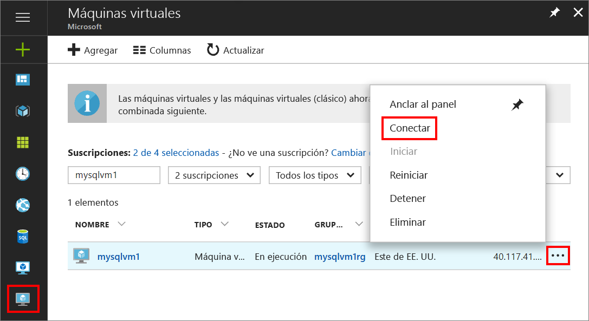
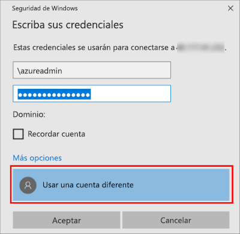

1. Una vez creada y en ejecución la máquina virtual de Azure, haga clic en el icono Virtual Machines en Azure Portal para ver las máquinas virtuales.

1. Haga clic en el botón de puntos suspensivos, **...** , de la nueva máquina virtual.

1. Haga clic en **Conectar**.

   

1. Abra el archivo **RDP** que ha descargado el explorador para la máquina virtual.

1. La conexión a Escritorio remoto le avisará de que no se puede identificar el publicador de esta conexión remota. Haga clic en **Conectar** para continuar.

1. En el cuadro de diálogo **Seguridad de Windows**, haga clic en **Usar una cuenta diferente**. Es posible que deba hacer clic en **Más opciones** para verlo. Use el nombre de usuario y la contraseña que configuró al crear la máquina virtual. Debe agregar una barra diagonal inversa delante del nombre de usuario.

   

1. Haga clic en **Aceptar** para conectar.
